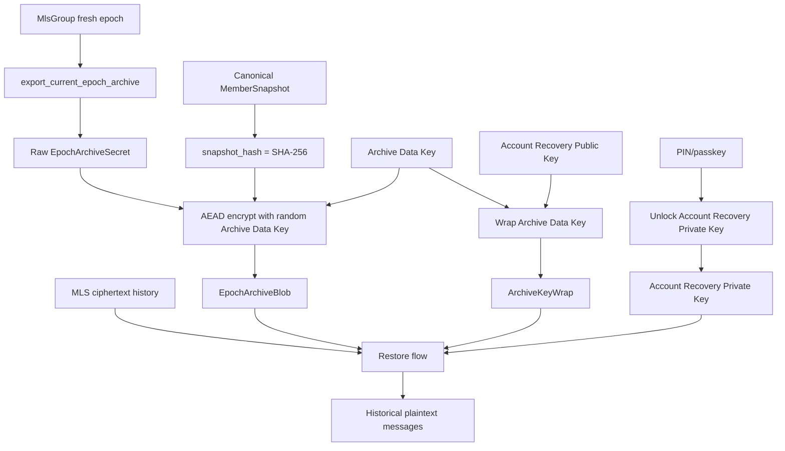
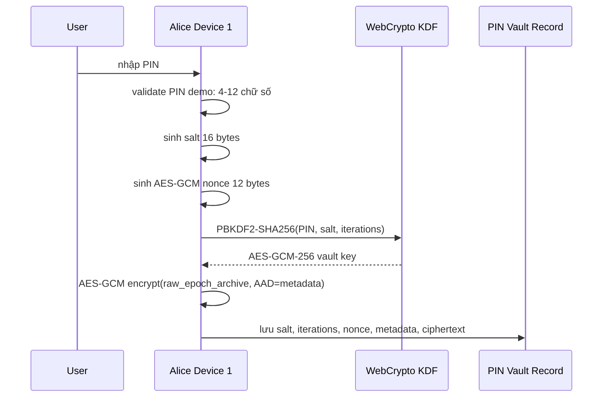
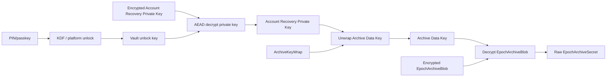
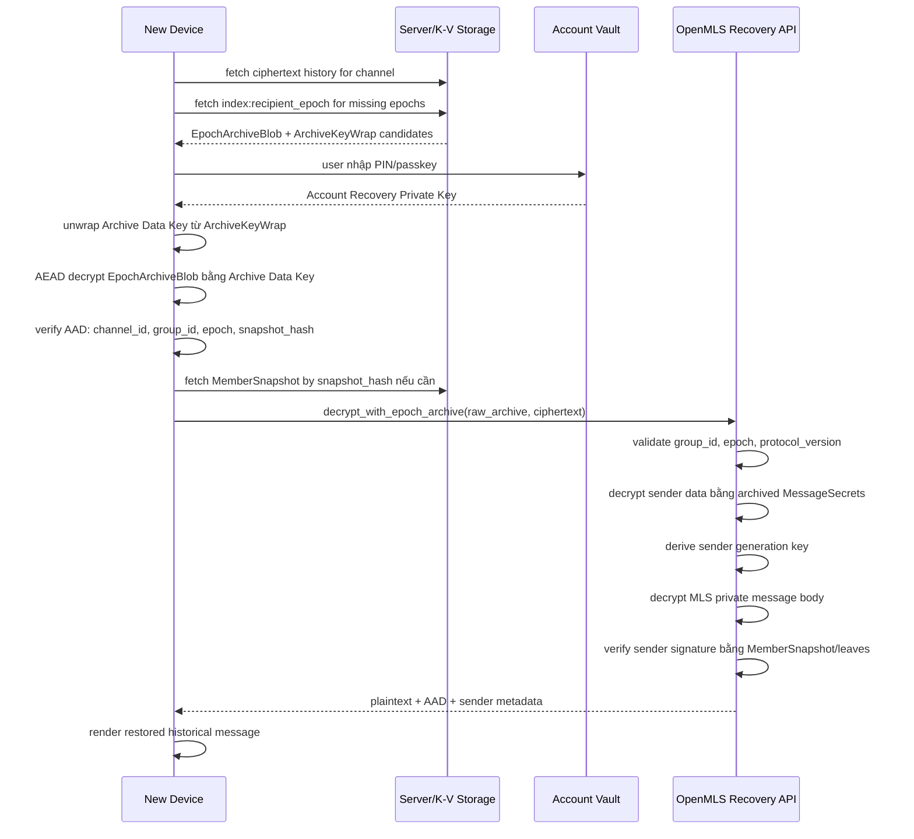
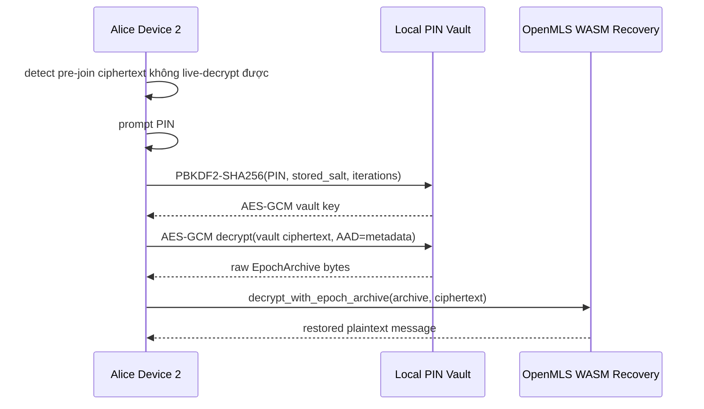

# Đề xuất kỹ thuật: PIN Epoch Archive để khôi phục lịch sử E2EE/MLS

Status: đề xuất kỹ thuật dựa trên POC hiện có.

Đối tượng đọc: CTO, Tech Lead, Security Lead, Backend/Mobile/Web Lead.

Nguồn tham chiếu nội bộ:

- `PIN_EPOCH_ARCHIVE_RESEARCH.md`
- `openmls/src/group/mls_group/epoch_archive.rs`
- `openmls-wasm/static/react-chat-v4/src/App.tsx`

## 1. Tóm tắt đề xuất

Mục tiêu là cho phép một thiết bị mới khôi phục lịch sử tin nhắn E2EE/MLS cũ sau khi join group ở epoch mới hơn, trong khi server vẫn không đọc được nội dung tin nhắn hoặc MLS secret.

Hướng đề xuất:

```text
Hybrid PIN Epoch Archive

Primary path: account-owned archive
Fallback path: group-sponsored archive
Storage model: one encrypted archive blob + many small key wraps
```

POC hiện tại đã chứng minh phần khó nhất về mặt MLS: một ciphertext cũ có thể được giải mã bằng archive chứa secret của đúng epoch, ngay cả khi live `MlsGroup` cũ đã bị drop hoặc đã vượt quá `max_past_epochs`.

Điểm cần chốt ở production: PIN không nên trực tiếp mã hóa toàn bộ archive của mọi epoch. PIN/passkey chỉ nên mở khóa một **Account Recovery Private Key**. Khóa private này sau đó unwrap **Archive Data Key** để giải mã archive blob.

```text
PIN/passkey
  -> mở Account Recovery Private Key
  -> unwrap Archive Data Key
  -> decrypt encrypted EpochArchiveBlob
  -> decrypt historical MLS ciphertext
```

## 2. Những công nghệ cần dùng

### 2.1 Core MLS và recovery

- **OpenMLS/Rust**: nguồn sự thật cho group state, epoch, MessageSecrets, sender ratchet, signature verification.
- **Epoch Archive API**: API POC đang có:
  - `MlsGroup::export_current_epoch_archive()`
  - `decrypt_with_epoch_archive()`
  - `peek_sender_data_from_archive()`
  - `RecoveryDecryptOptions`
- **TLS serialization cho MLS message**: ciphertext MLS vẫn là format chuẩn OpenMLS xử lý.
- **Serde/structured serialization cho archive POC**: POC hiện serialize archive bằng JSON bytes. Production nên chuẩn hóa encoding ổn định hơn nếu cần tương thích đa client.

### 2.2 Mã hóa và dẫn xuất khóa

Trong POC React v4:

- **PBKDF2-SHA256**: derive key từ PIN.
- **AES-GCM-256**: mã hóa archive bytes bằng key derive từ PIN.
- **Random salt 16 bytes**: lưu kèm vault record để derive lại key khi user nhập PIN.
- **Random nonce/IV 12 bytes**: dùng cho AES-GCM.
- **AAD trong AES-GCM**: bind metadata như owner, device, channel, epoch vào ciphertext.
- **SHA-256**: hash canonical `MemberSnapshot` để reuse snapshot an toàn.

Trong production nên dùng:

- **AEAD** cho `EpochArchiveBlob`, ví dụ AES-GCM-256 hoặc AEAD theo crypto suite được chuẩn hóa cho client.
- **HPKE/public-key encryption hoặc envelope encryption** để wrap `Archive Data Key` bằng `Account Recovery Public Key`.
- **PIN/passkey/platform keystore** để bảo vệ `Account Recovery Private Key`.
- **Argon2id hoặc KDF tương đương trên mobile/native**, nếu platform hỗ trợ tốt. Với web browser thuần WebCrypto, PBKDF2-SHA256 là lựa chọn thực dụng vì có sẵn trong WebCrypto.
- **SHA-256 content addressing** cho `MemberSnapshot`.

### 2.3 Storage và backend

Server vẫn chỉ là relay/storage, không decrypt.

Các namespace hiện có giữ nguyên:

```text
mls:{cid}             -> MLS protocol events: proposal, commit, welcome, external_commit
group_info:{cid}      -> latest GroupInfo only, phục vụ external join
```

Đề xuất thêm storage riêng:

```text
mls:archive:{cid}     -> recovery archive K-V namespace
```

Logical records:

```text
MemberSnapshot
- snapshot_hash
- channel_id
- mls_group_id
- public verification material
- first_seen_epoch / last_seen_epoch
```

```text
EpochArchiveBlob
- archive_blob_id
- channel_id
- mls_group_id
- epoch
- archive_scope: account_owned | group_sponsored
- exporter_user_id
- exporter_device_id
- member_snapshot_hash
- encrypted_archive_bytes
- aead_nonce
- created_at
```

```text
ArchiveKeyWrap
- archive_blob_id
- recipient_user_id
- recipient_recovery_key_id
- wrapped_archive_data_key
- wrap_alg
- readable_epoch_from
- readable_epoch_to
- created_at
```

## 3. Triển khai như thế nào

### 3.1 POC hiện tại đang triển khai

POC có hai lớp:

1. **OpenMLS epoch recovery layer**
   - Export archive của epoch hiện tại.
   - Archive chứa `group_id`, `epoch`, `ciphersuite`, `protocol_version`, `sender_ratchet_config`, `message_secrets`, `leaves`, `own_leaf_index`.
   - Dùng archive này để decrypt ciphertext cũ bằng `decrypt_with_epoch_archive()`.
   - Sau khi decrypt, verify sender signature bằng member/leaves snapshot trong archive.

2. **React/WebCrypto PIN vault layer**
   - Alice device 1 tạo PIN.
   - Client derive AES-GCM key từ PIN bằng PBKDF2-SHA256.
   - Client mã hóa raw epoch archive bytes bằng AES-GCM.
   - Alice device 2 nhập PIN để mở archive.
   - Alice device 2 gọi `decrypt_with_epoch_archive()` để restore tin nhắn cũ.

POC chứng minh UX và data flow, nhưng chưa phải kiến trúc production tối ưu vì PIN đang trực tiếp bảo vệ raw archive.

### 3.2 Kiến trúc production đề xuất

Production nên triển khai theo envelope encryption:

```text
Raw EpochArchiveSecret
  -> encrypt bằng Archive Data Key ngẫu nhiên
  -> tạo EpochArchiveBlob

Archive Data Key
  -> wrap cho từng recipient bằng Account Recovery Public Key
  -> tạo nhiều ArchiveKeyWrap nhỏ

Account Recovery Private Key
  -> được khóa bằng PIN/passkey/platform keystore
```

Lý do:

- Đổi PIN không cần mã hóa lại mọi archive của mọi epoch.
- Một archive blob có thể phục vụ nhiều user/device thông qua nhiều key wrap nhỏ.
- Group-sponsored archive có thể được tạo cho user offline bằng public recovery key, không cần biết PIN của user.
- Server chỉ lưu encrypted blob và wrapped key, không biết plaintext.

### 3.3 Hook khi có fresh epoch

Mỗi khi group tạo epoch mới sau create/join/add/remove/update/key rotation:

```text
1. Client merge commit hoặc join group thành công.
2. Export latest GroupInfo và overwrite group_info:{cid}.
3. Build canonical MemberSnapshot từ post-merge group.
4. Tính snapshot_hash = SHA-256(canonical member verification material).
5. Nếu snapshot_hash chưa tồn tại, lưu MemberSnapshot.
6. Export EpochArchiveSecret cho epoch mới.
7. Sinh Archive Data Key ngẫu nhiên.
8. AEAD encrypt EpochArchiveSecret thành EpochArchiveBlob.
9. Tạo ArchiveKeyWrap cho các user được phép restore epoch này.
10. Lưu blob/wrap/index vào mls:archive:{cid}.
```

AAD của archive blob nên bind ít nhất:

```text
channel_id
mls_group_id
epoch
archive_version
archive_scope
exporter_user_id
exporter_device_id
member_snapshot_hash
```

Nếu server hoặc network tráo blob sang channel/epoch khác, AEAD verification sẽ fail.

### 3.4 Policy cấp quyền đọc lịch sử

Không được cấp archive access chỉ theo `user_id`. Phải dựa trên membership interval.

Ví dụ:

```text
Alice joined epoch 1
Alice removed epoch 7
Alice re-added epoch 12
```

Alice được restore:

```text
epoch 1..7
epoch 12..
```

Alice không được nhận key wrap cho:

```text
epoch 8..11
```

Production cần service/policy:

```text
can_user_restore_epoch(user_id, channel_id, epoch) -> bool
```

Chỉ khi policy trả về true mới tạo `ArchiveKeyWrap`.

## 4. Diagram tổng quan kiến trúc



## 5. Diagram A: PIN được mã hóa như thế nào và PIN hoạt động ra sao

Điểm quan trọng: **PIN không được mã hóa rồi đem lưu**. Thiết kế đúng là không lưu PIN plaintext, cũng không cần lưu "PIN đã mã hóa" như một secret có thể dùng lại.

PIN chỉ là input để derive hoặc unlock khóa khác.

### 5.1 POC hiện tại

POC React v4 đang làm:

```text
PIN
  + random salt
  + PBKDF2-SHA256 iterations
  -> AES-GCM-256 vault key
  -> AES-GCM encrypt raw EpochArchive bytes
```

Vault record lưu:

```text
version
kdf = PBKDF2-SHA256
iterations
salt
nonce
ciphertext
metadata
```

Vault record không lưu PIN.



Khi PIN sai:

```text
PIN sai -> derive ra key sai -> AES-GCM tag verification fail -> không mở được archive
```

### 5.2 Production đề xuất

Production nên tách PIN khỏi archive data:

```text
PIN/passkey
  -> unlock Account Recovery Private Key
  -> private key unwrap Archive Data Key
  -> Archive Data Key decrypt EpochArchiveBlob
```



Lợi ích khi đổi PIN:

```text
Old PIN unlocks Account Recovery Private Key
New PIN re-encrypts Account Recovery Private Key
ArchiveBlob và ArchiveKeyWrap không cần mã hóa lại
```

## 6. Diagram B: Dùng PIN để giải mã lịch sử tin nhắn như thế nào

### 6.1 Restore flow production



### 6.2 Restore flow POC hiện tại

Trong POC, không có Account Recovery Private Key. PIN mở thẳng raw archive:



## 7. Vì sao archive giải mã được message cũ

MLS live group state thường chỉ giữ một số epoch cũ theo `max_past_epochs`. Khi thiết bị mới join ở epoch 10, nó không có live state của epoch 1, nên không thể decrypt ciphertext epoch 1 theo đường live.

Epoch archive giữ đúng các dữ liệu epoch-local cần cho recovery:

```text
group_id
epoch
ciphersuite
protocol_version
sender_ratchet_config
message_secrets
member verification snapshot / leaves
own_leaf_index
```

OpenMLS recovery API làm:

```text
1. Parse MLS private message.
2. Check ciphertext group_id == archive group_id.
3. Check ciphertext epoch == archive epoch.
4. Check protocol version.
5. Decrypt sender data bằng archived MessageSecrets.
6. Tìm sender leaf trong snapshot.
7. Derive ratchet generation key.
8. Decrypt message body.
9. Verify sender signature.
10. Trả plaintext application bytes và AAD.
```

PIN không decrypt trực tiếp MLS message. PIN chỉ mở khóa archive secret. MLS message vẫn được decrypt bằng MLS epoch secret và sender ratchet đúng chuẩn OpenMLS.

## 8. Account-owned và group-sponsored archive

### 8.1 Account-owned archive

Thiết bị của Alice export archive cho chính account Alice.

```text
scope = account_owned
exporter_user_id = alice
recipient_user_id = alice
```

Đây là primary path vì ownership rõ và privacy reasoning đơn giản.

Hạn chế: nếu toàn bộ device của Alice offline từ epoch 6 đến epoch 10, Alice không thể tự tạo account-owned archive cho các epoch đó.

### 8.2 Group-sponsored archive

Một member online có thể sponsor archive cho epoch hiện tại và wrap Archive Data Key cho các user đủ quyền.

Ví dụ:

```text
Bob online tại epoch 6
Bob export epoch 6 archive
Bob encrypt archive bằng random Archive Data Key
Bob wrap Archive Data Key cho Alice bằng Account Recovery Public Key của Alice
Alice device mới sau này unlock private key bằng PIN/passkey và unwrap Archive Data Key
```

Group-sponsored archive giải quyết offline gap nhưng cần policy chặt để không cấp quyền đọc epoch mà user không còn là member.

## 9. Khác biệt giữa POC và production

| Thành phần | POC hiện tại | Production đề xuất |
|---|---|---|
| PIN | Derive AES-GCM key trực tiếp | Unlock Account Recovery Private Key |
| KDF | PBKDF2-SHA256 trong WebCrypto | PBKDF2 cho web hoặc Argon2id/platform KDF nếu khả dụng |
| Archive encryption | AES-GCM encrypt raw archive bằng PIN-derived key | AEAD encrypt archive bằng random Archive Data Key |
| Key wrap | Demo record mô phỏng | Public-key/envelope wrap cho từng recipient |
| Storage | Local/in-memory/browser state | `mls:archive:{cid}` K-V namespace |
| MemberSnapshot | React canonicalization POC | OpenMLS/WASM canonical snapshot API |
| GroupInfo | Latest-only | Giữ latest-only, không dùng làm recovery store |
| Server trust | Server không decrypt | Server vẫn không decrypt |

## 10. Rủi ro và quyết định cần CTO chốt

Các quyết định cần chốt trước production:

1. Chọn cơ chế bảo vệ `Account Recovery Private Key`: PIN + KDF, passkey, platform keystore, hoặc kết hợp.
2. Chọn thuật toán wrap `Archive Data Key`: HPKE theo MLS ciphersuite hay envelope encryption riêng của app.
3. Chọn K-V namespace cuối cùng: `mls:archive:{cid}` hay `mls_archive:{cid}`.
4. Chốt retention policy cho archive blob và key wrap.
5. Chốt membership policy khi remove/re-add user.
6. Chốt số lượng alternate archive cần giữ cho cùng `(channel_id, epoch, scope)`.
7. Chốt canonical encoding cho `MemberSnapshot` trong OpenMLS/WASM để web, mobile, native tính cùng `snapshot_hash`.

Khuyến nghị của tôi:

```text
Proceed với production design theo envelope encryption.
Không dùng mô hình PIN mã hóa trực tiếp mọi archive ngoài phạm vi demo.
Giữ POC hiện tại để validate UX/manual test.
Ưu tiên build OpenMLS/WASM canonical MemberSnapshot API và K-V archive contract trước backend production.
```

## 11. Kết luận

Ý tưởng kỹ thuật khả thi và POC đã chứng minh phần recovery cốt lõi. Thiết kế production nên giữ nguyên nguyên tắc E2EE: server không thấy plaintext, không thấy MLS secret, không biết PIN.

PIN là cổng mở khóa recovery capability của account, không phải khóa trực tiếp của từng tin nhắn. Lịch sử tin nhắn chỉ được khôi phục khi có đủ ba điều kiện:

```text
1. Có ciphertext lịch sử.
2. Có epoch archive hợp lệ cho đúng group/epoch.
3. User có quyền và có thể unwrap Archive Data Key bằng recovery key được PIN/passkey bảo vệ.
```

Thiết kế này cân bằng được ba mục tiêu: UX khôi phục lịch sử tốt hơn, quyền truy cập bám theo membership, và server vẫn không thể decrypt dữ liệu E2EE.
