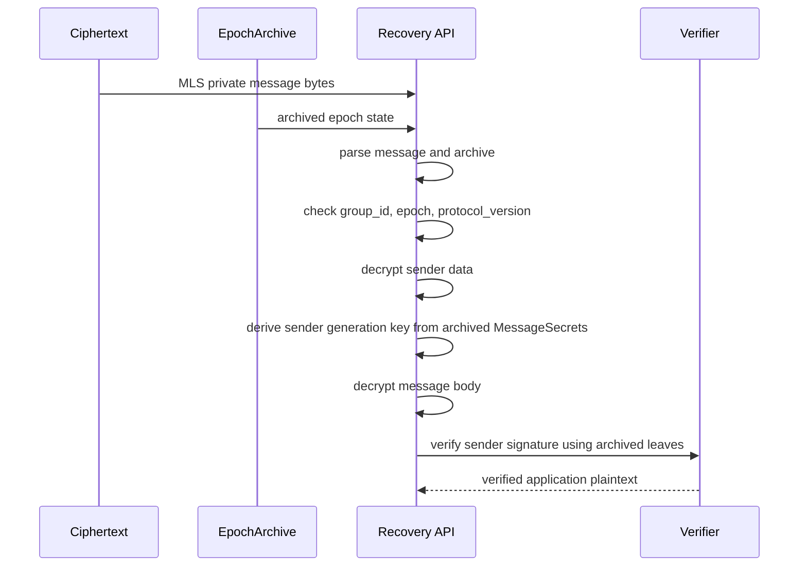
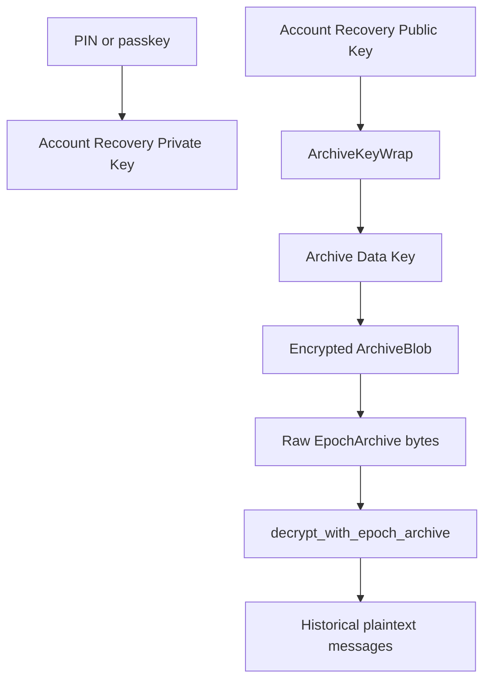
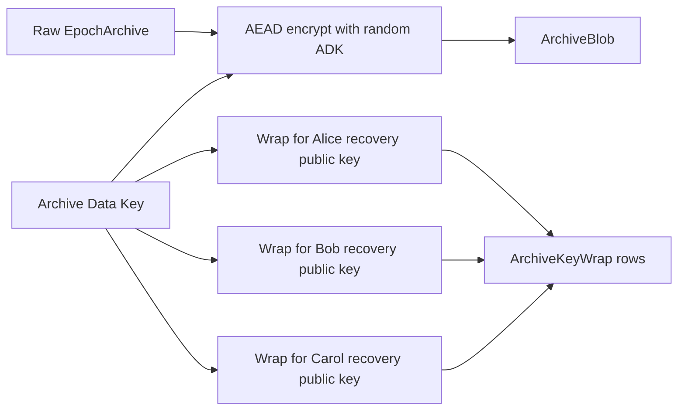
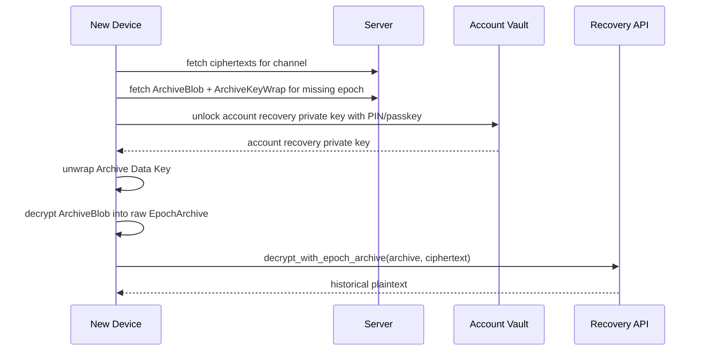
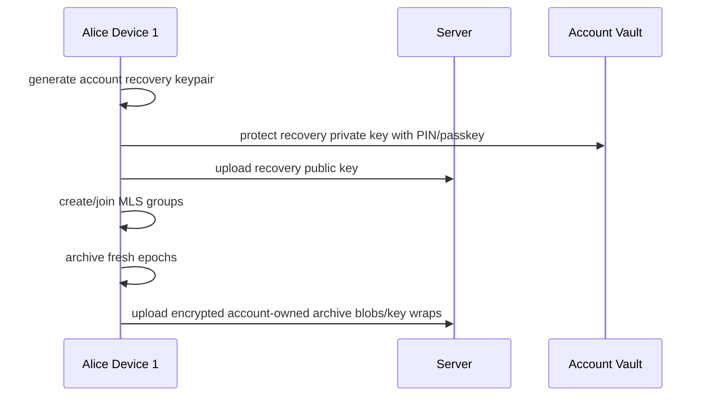

# PIN + Epoch Archive Research Notes

Status: research and POC design note.

Scope: summarize the current PIN + Epoch Archive discussion, the implemented OpenMLS/WASM/React POC, and the production design directions that are not implemented yet.

Source notes:

- Current working thread around `EPOCH_ARCHIVE_POC_PLAN.md`, `react-chat-v3`, and `react-chat-v4`.
- Referenced conversation id `019e1b16-477b-7f33-a29c-93b6bb476aa1` appears in local Codex session index as `Phan tich PIN Messenger`, but the raw transcript was not available under `.codex/sessions`. The Messenger/WhatsApp/Telegram analysis below is reconstructed from the conclusions re-discussed in the current thread.

## 1. Executive Summary

The chosen production direction is **Hybrid PIN Epoch Archive**:

```text
Primary path: account-owned archive
Fallback path: group-sponsored archive
Storage model: one encrypted archive blob + many small key wraps
```

The POC already proves that an MLS private message can be recovered from epoch-local archived secrets without the old live `MlsGroup` state. The PIN layer added in `react-chat-v3` and `react-chat-v4` demonstrates the application-level vault that protects archive bytes before they leave the device.

The important production correction is that a PIN should not directly encrypt every epoch archive. The recommended model is:

```text
PIN/passkey -> unlocks account recovery private key
account recovery private key -> unwraps archive data keys
archive data key -> decrypts encrypted epoch archive blob
epoch archive -> decrypts historical MLS ciphertext
```

This avoids re-encrypting all archives on PIN rotation and allows group-sponsored archives to be wrapped for offline users without knowing their PIN.

## 2. Implemented POC State

### Core OpenMLS

Implemented in `openmls/src/group/mls_group/epoch_archive.rs`:

- `MlsGroup::export_current_epoch_archive()`
- `decrypt_with_epoch_archive()`
- `peek_sender_data_from_archive()`
- `RecoveryDecryptOptions`
- `ArchivedPlaintext`
- `ArchivedSenderData`

The current archive contains:

```rust
archive_version
group_id
epoch
ciphersuite
protocol_version
sender_ratchet_config
message_secrets
leaves
own_leaf_index
```

The archive bytes are sensitive MLS key material. The WASM wrapper explicitly documents that applications must encrypt these bytes with a PIN/vault key before upload or persistence outside the device.

### Core Test Coverage

Implemented tests cover:

- historical decrypt after live state is dropped
- own sent message recovery, bypassing normal `CannotDecryptOwnMessage`
- recovery after live group moved past `max_past_epochs(5)`
- multiple messages in one epoch, sorted by sender generation
- out-of-order recovery using a fresh archive clone per message
- recovery-only `max_forward_distance` override
- recovery does not mutate live MLS group state

### WASM API

The WASM layer exposes:

```text
group.archive_current_epoch() -> Vec<u8>
peek_sender_data_from_archive(provider, archive, ciphertext)
decrypt_with_epoch_archive(provider, archive, ciphertext, allow_own_messages, max_forward_distance)
```

### React Demo v3

`react-chat-v3` is a scripted visual demo:

- Alice device 1 and Bob create old epoch 1 chat history.
- Alice device 1 creates a scripted PIN.
- Alice device 1 encrypts the epoch 1 archive into a PIN vault using WebCrypto.
- The group advances to epoch 9.
- Alice device 2 joins at epoch 10.
- Alice device 2 cannot live-decrypt epoch 1 ciphertext.
- Alice device 2 uses the PIN to unlock the encrypted vault record.
- Alice device 2 restores old epoch 1 messages from the unlocked archive.
- New epoch 10 messages still decrypt live on all devices.

The v3 PIN vault is demo-level:

```text
PBKDF2-SHA256 + AES-GCM-256
PIN directly derives the wrapping key
archive bytes are encrypted directly under the PIN-derived key
```

This is good enough to prove UX and data flow, but production should use an account recovery key layer.

### React Demo v4

`react-chat-v4` is interactive:

- Alice device 1 manually creates a PIN.
- Each device box has a text input and send button.
- Alice device 2 has a `Join Alice 2` action.
- Alice device 2 has a `Restore old messages` action that prompts for PIN.
- There is a `Key rotate` action that advances the MLS epoch via Alice device 1 self-update.
- If a PIN vault exists, `Key rotate` prompts for PIN and seals the new epoch archive into the vault.

This demo is useful for manual testing:

```text
send old messages at epoch 1
create PIN
join Alice 2 at epoch 10
restore old messages with PIN
send live messages after join
rotate epoch and continue sending
```

## 3. Why Epoch Archive Works

MLS application message decryption does not require the full old live `MlsGroup` state. It requires epoch-local material:

- group id
- epoch
- ciphersuite
- protocol version
- sender ratchet configuration
- message secrets
- sender membership/signature snapshot

The recovery flow is:



Live OpenMLS state may discard old epoch secrets because of `max_past_epochs`. Archive recovery remains possible because the archive stores the epoch-local message secrets that live state no longer keeps.

## 4. PIN Vault: Demo vs Production

### Demo Model

The demos currently use:

```text
PIN -> PBKDF2 key -> AES-GCM encrypt raw epoch archive
```

This demonstrates the core product behavior:

- Alice device 1 creates a PIN.
- Alice device 1 seals archive bytes.
- Alice device 2 enters the same PIN.
- Alice device 2 unlocks archive bytes and restores old messages.

### Production Model

Production should use:

```text
PIN/passkey -> unlock Account Recovery Private Key
Account Recovery Public Key -> used by devices/sponsors to wrap Archive Data Keys
Archive Data Key -> encrypts one archive blob
```

Recommended key hierarchy:



Why this is better:

- PIN rotation only rewraps the account recovery private key.
- Group members can wrap archive access for Alice using Alice's public recovery key without knowing Alice's PIN.
- Archive blobs are encrypted once and shared through small key wraps.
- Device revoke and account recovery policy can be handled independently.

## 5. Chosen Production Direction: Hybrid

The chosen direction is **C Hybrid**:

```text
1. Try account-owned archive.
2. If missing, try group-sponsored archive.
3. If still missing, wait for old-device backfill or show a history gap.
```

### Account-Owned Archive

Alice's own device exports and uploads an archive for Alice's account.

```text
scope = account_owned
exporter_user_id = alice
recipient_user_id = alice
```

This is the primary path because ownership is clear and privacy reasoning is simpler.

Limitation:

If all Alice devices are offline from epoch 6 to epoch 10, Alice cannot produce account-owned archives for those epochs.

### Group-Sponsored Archive

An online group member can sponsor an archive for an epoch and wrap its archive data key for all eligible users.

Example:

```text
Bob is online at epoch 6.
Bob exports epoch 6 archive.
Bob encrypts archive bytes once with a random Archive Data Key.
Bob wraps that Archive Data Key for Alice, Bob, and other eligible users.
Alice device 4 later unlocks Alice's account recovery private key and unwraps the Archive Data Key.
```

This handles the offline gap case:

```text
Alice devices offline at epoch 5
current group epoch is 10
Alice device 4 logs in
account-owned archive exists only up to epoch 5
group-sponsored archives can cover epoch 6..10
```

If neither account-owned nor group-sponsored archive exists for an epoch, cryptographic recovery is impossible until an old authorized device backfills the missing archive.

## 6. GroupInfo, MemberSnapshot, and Recovery Storage

Keep the current Bellboy external-join mechanism unchanged.

Current Bellboy behavior:

```text
external join store: group_info:{cid}
write behavior: clear_room_messages(group_info:{cid}) + send latest GroupInfo
read behavior: query_n_latest_events(group_info:{cid}, 1)
API role: GET /v1/e2ee/channels/{type}/{id}/group_info for external join
```

This means each channel intentionally keeps only the latest GroupInfo. That is correct for external join because a joining device only needs a fresh authenticated group state to create an External Commit into the current epoch.

GroupInfo must not become the historical recovery store:

```text
latest GroupInfo at epoch 10
!=
verification material and MessageSecrets for epoch 1..9
```

A latest GroupInfo does not contain historical MLS message secrets, and using it as the only reference for old ciphertext verification is wrong because old epochs may have different leaf keys, credentials, membership, and tree state.

### Separate Recovery Storage

Recovery should use a separate storage surface from `group_info:{cid}`:

```text
latest_group_info          -> external join only, keep latest as today
member_snapshot_store      -> public verification material, content-addressed by hash
epoch_archive_blob_store   -> encrypted epoch-local MLS secret material
archive_key_wrap_store     -> small access grants to decrypt archive data keys
```

A production logical schema can be:

```text
LatestGroupInfo
- channel_id / cid
- mls_group_id
- epoch
- group_info_bytes
- updated_at
```

```text
MemberSnapshot
- snapshot_hash
- channel_id / cid
- mls_group_id
- first_seen_epoch / last_seen_epoch metadata, not part of snapshot_hash
- ciphersuite
- protocol_version
- public_tree_bytes or canonical member list
- member credential / signature-key material needed for recovery verification
- created_at
```

```text
EpochArchiveBlob
- archive_blob_id
- channel_id / cid
- mls_group_id
- epoch
- archive_scope: account_owned | group_sponsored
- exporter_user_id
- exporter_device_id
- member_snapshot_hash
- encrypted_archive_bytes
- aead_nonce
- created_at
```

```text
ArchiveKeyWrap
- archive_blob_id
- recipient_user_id
- recipient_recovery_key_id
- wrapped_archive_data_key
- wrap_alg
- readable_epoch_from
- readable_epoch_to
- created_at
```

### Storage Placement Choice

For `react-chat-v4` POC, do not add backend storage. Keep the demo local-only as it is today:

```text
latestGroupInfoStore       -> in-memory/browser-local only
memberSnapshotStore        -> in-memory/browser-local only
archiveBlobStore           -> in-memory/browser-local only
archiveKeyWrapStore        -> in-memory/browser-local only
```

For Bellboy production direction, prefer datastore/concierge-style K-V storage for MLS recovery material instead of PostgreSQL-first. The reason is pragmatic: Bellboy already treats MLS protocol state as a separate storage surface (`mls:{cid}` for protocol events, `group_info:{cid}` for latest GroupInfo), and recovery archive records are opaque binary protocol artifacts rather than relational business rows.

Current namespaces stay unchanged:

```text
mls:{cid}             -> persisted protocol events: commit/welcome/proposal/external_commit
group_info:{cid}      -> latest GroupInfo only, overwritten for external join
```

Add a separate recovery namespace:

```text
mls:archive:{cid}     -> recovery archive K-V namespace for this channel
```

If any Bellboy component later treats `mls:*` as a broad subscription pattern, use `mls_archive:{cid}` instead. With the current exact room construction (`format!("mls:{cid}")`), `mls:archive:{cid}` is distinct and should not collide with protocol event sync.

Recommended K-V shape inside `mls:archive:{cid}`:

```text
snapshot:{snapshot_hash}
  -> MemberSnapshot bytes

blob:{epoch}:{scope}:{archive_blob_id}
  -> EpochArchiveBlob metadata + encrypted_archive_bytes

wrap:{recipient_user_id}:{epoch}:{recovery_key_id}:{archive_blob_id}
  -> ArchiveKeyWrap bytes

index:epoch:{epoch}
  -> list of archive_blob_id candidates for that epoch

index:recipient_epoch:{recipient_user_id}:{epoch}
  -> list of wrap references the user may try for that epoch
```

If the selected datastore supports efficient prefix/range scans, the index keys can be thinner. If it only supports `get/put/remove` style K-V access, keep explicit index entries so restore does not require scanning the whole channel archive namespace.

Do not put recovery archives into `mls:{cid}`. That room is for ordered protocol sync and may have different retention/TTL semantics. Recovery blobs need longer retention, recipient-specific access lookup, and idempotent upload behavior.

The first backend implementation should therefore be:

```text
POC: no backend; local in-memory stores only
Production direction: datastore/concierge K-V namespace mls:archive:{cid}
PostgreSQL: optional later only for audit/index/reporting if K-V lookup is insufficient
```

### MemberSnapshot Reference

The current POC archive stores `leaves: Vec<Member>` directly. That is acceptable for proving recovery but too expensive for large groups and repeated epochs.

Production should split the data:

```text
EpochArchiveSecret
- group_id
- epoch
- ciphersuite
- protocol_version
- sender_ratchet_config
- message_secrets
- own_leaf_index
- member_snapshot_hash
```

```text
MemberSnapshot
- snapshot_hash
- group_id
- snapshot_version
- public verification data
- first_seen_epoch / last_seen_epoch metadata, not part of snapshot_hash
```

Restore then becomes:

```text
1. find ciphertext epoch
2. find an eligible ArchiveKeyWrap for the recovering account
3. unwrap Archive Data Key
4. decrypt EpochArchiveBlob
5. read member_snapshot_hash from archive metadata/AAD
6. fetch MemberSnapshot by hash
7. decrypt ciphertext with archived MessageSecrets
8. verify sender signature against the referenced MemberSnapshot
```

### Reuse Optimization, Done Safely

The optimization is not "reuse because the commit probably did not change members". That shortcut is unsafe because self-update, external join, remove, add, and credential/key rotations can change the public verification inputs used by recovery.

The safe check is content-addressing:

```text
snapshot_hash = SHA-256(canonical_recovery_verification_snapshot_bytes)
reuse MemberSnapshot only if snapshot:{snapshot_hash} already exists
otherwise store a new MemberSnapshot
```

Important detail: do not include `epoch` in the reusable snapshot hash. If epoch is included, every commit creates a different hash and reuse becomes impossible. The epoch is instead bound in the encrypted archive metadata/AAD:

```text
Archive AAD = Hash(channel_id, group_id, epoch, scope, exporter_device_id, snapshot_hash, archive_version)
MemberSnapshot hash = Hash(public verification material only)
```

So the archive still says "this secret material is for epoch N", while the snapshot can be reused across epochs whose public verification material is byte-identical.

#### Optimized POC Hash

`react-chat-v4` now uses the optimized hash in the POC itself. The local recovery store computes a WebCrypto SHA-256 over canonical member verification material and intentionally excludes both `epoch` and `encryption_key`:

```text
canonical_snapshot_v2 = canonical_json({
  snapshot_version: 2,
  hash_mode: optimized-member-signatures,
  group_id,
  protocol_version,
  ciphersuite,
  signature_scheme,
  members: sort_by_leaf_index([
    {
      leaf_index,
      user_id_or_credential_bytes,
      signature_key
    }
  ])
})

snapshot_hash = sha256(canonical_snapshot_v2)
```

This gives the POC the behavior production wants to study: self-update/key-rotation epochs can reuse the same `MemberSnapshot` if the member leaf identity and signature verification keys did not change. The raw Rust archive still contains `leaves` internally for the current recovery API, but the POC storage metadata already models the split `member_snapshot_hash` design.

Check in code:

```ts
const snapshotBytes = canonicalizeRecoverySnapshot(group.members(), group.groupId());
const snapshotHash = await sha256Hex(snapshotBytes);

if (memberSnapshotStore.has(snapshotHash)) {
  log(`MemberSnapshot reused: ${snapshotHash.slice(0, 12)}`);
} else {
  memberSnapshotStore.set(snapshotHash, { snapshotHash, snapshotBytes, epoch });
  log(`MemberSnapshot stored: ${snapshotHash.slice(0, 12)}`);
}
```

#### Production Hash API Follow-Up

The remaining production follow-up is to expose the same canonical snapshot format from OpenMLS/WASM instead of duplicating canonicalization logic in React.

With the current POC recovery code in `epoch_archive.rs`, decrypt/verify uses:

```text
archive.group_id
sender leaf_index
sender signature_key
archive.ciphersuite.signature_algorithm()
archive.protocol_version
archive.message_secrets
```

`message_secrets` are private and stay in `EpochArchiveBlob`. The reusable public verification snapshot can stay narrow, but production should move canonical encoding into OpenMLS/WASM so all clients compute identical hashes. A later Rust-side `RecoveryMemberSnapshot` API can remove the remaining mismatch where the raw POC archive still serializes full `Member` leaves.

#### Fresh-Epoch Hook

Every fresh epoch should run the same logic:

```text
1. merge/create/join commit
2. export latest GroupInfo and overwrite group_info:{cid}
3. build canonical recovery verification snapshot from the post-merge group
4. compute snapshot_hash
5. check mls:archive:{cid} / snapshot:{snapshot_hash}
6. store snapshot only if absent
7. export current EpochArchiveSecret and attach member_snapshot_hash
8. encrypt archive blob with random Archive Data Key
9. store blob:{epoch}:{scope}:{archive_blob_id}
10. store wrap/index records for eligible recovery keys
```

In the POC log, show both the decision and the reason when possible:

```text
MemberSnapshot reused hash=abc123 epoch=8 reason=same canonical members
MemberSnapshot stored hash=def456 epoch=9 reason=leaf 2 signature_key changed
MemberSnapshot stored hash=789abc epoch=10 reason=leaf 3 added for alice-device-2
```

The reason can be computed by diffing the previous canonical snapshot against the new one by `leaf_index` and field name. This diff is for operator/debug visibility only; the cryptographic decision is still the hash equality check.

#### Reuse Test Matrix

```text
send application message only
  -> no new epoch, no snapshot check

key rotate / self update
  -> conservative v1 usually changes because encryption_key changes
  -> optimized v2 may reuse if leaf_index + credential + signature_key are unchanged

Alice device 2 external join
  -> new leaf appears, snapshot_hash changes

remove member
  -> leaf set changes, snapshot_hash changes

remove then re-add same user
  -> snapshot may or may not match depending leaf/signature material
  -> access is still controlled by ArchiveKeyWrap membership intervals, not by snapshot hash alone

server returns wrong snapshot for archive
  -> snapshot_hash mismatch with archive metadata/AAD or signature verification fails
```

## 7. One Archive Blob + Many Key Wraps

The storage model should avoid:

```text
epochs x users x devices x full_archive_blob
```

For a group with 1000 users and 3 devices each, that naive model becomes:

```text
epochs x 3000 full archive records
```

Instead use:

```text
few encrypted archive blobs per channel/epoch
+
many small key wraps per eligible user/account
```

### Logical Schema

```text
ArchiveBlob
- archive_blob_id
- channel_id
- mls_group_id
- epoch
- archive_version
- archive_scope: account_owned | group_sponsored
- exporter_user_id
- exporter_device_id
- exporter_leaf_index
- member_snapshot_hash
- encrypted_archive_bytes
- aead_nonce
- created_at
```

```text
ArchiveKeyWrap
- archive_blob_id
- recipient_user_id
- recipient_recovery_key_id
- wrapped_archive_data_key
- wrap_alg
- readable_epoch_from
- readable_epoch_to
- created_at
```

### Encryption Flow



AEAD AAD should bind at least:

```text
channel_id
mls_group_id
epoch
archive_version
archive_scope
exporter_user_id
exporter_device_id
member_snapshot_hash
```

This prevents server-side archive swapping across channels, epochs, or recipients.

### Restore Flow



### Race Behavior

If Alice has 3 devices online and all upload for the same user/channel/epoch:

```text
first valid upload -> primary
later uploads -> 200 already_satisfied or stored_as_alternate
```

Do not hard reject later uploads as errors. The server cannot decrypt archives, so the first upload may be corrupt or wrapped incorrectly. Keeping a small number of alternates improves recovery reliability.

## 8. Membership Policy

Archive access must be based on membership intervals, not just `user_id`.

Example:

```text
Alice joined at epoch 1
Alice removed at epoch 7
Alice re-added at epoch 12
```

Alice can read:

```text
epoch 1..7
epoch 12..
```

Alice must not get key wraps for:

```text
epoch 8..11
```

The production system needs a policy engine that answers:

```text
can_user_restore_epoch(user_id, channel_id, epoch) -> bool
```

Key wrapping must use this policy before creating `ArchiveKeyWrap` rows.

## 9. Bad Cases To Design For

### Upload Race

Multiple devices upload archives for the same user/channel/epoch.

Expected behavior:

```text
primary already exists -> return success/idempotent response
optionally keep alternate archive candidates
never treat later uploads as fatal client errors
```

### Corrupt First Archive

The first archive might be bad:

- upload truncated
- wrong AAD
- wrong recipient key
- client bug
- local state bug

Mitigation:

```text
keep primary + small alternate set
try alternates on restore failure
validate group_id/epoch/signature during recovery
```

### Missing Archive Gap

There can be ciphertext for epoch N but no archive for epoch N.

Expected UX:

```text
show history gap for epoch N
retry later
wait for old-device backfill
```

Do not present PIN as a magic recovery secret. PIN unlocks vault keys; it cannot recreate MLS epoch secrets that were never archived.

### All User Devices Offline

If Alice devices are offline from epoch 5 to 10, account-owned archive can only restore up to epoch 5.

To restore epoch 6..10 immediately, production needs group-sponsored archives created by online members.

Without group-sponsored archives:

```text
Alice device 4 must wait for an old Alice device to come online and backfill
or accept partial history
```

### Old Device Backfill

When an old Alice device comes back online:

```text
process pending commits in order
after each merge, export fresh epoch archive
upload missing archive records
retry upload until acknowledged
```

This requires a durable local upload queue.

### Wrong PIN and Brute Force

PIN-backed recovery must handle:

- wrong PIN
- repeated attempts
- online/offline brute force
- lockout and backoff
- recovery-code/passkey fallback

Production should prefer:

```text
PIN/passkey -> unlock account recovery private key
```

rather than:

```text
PIN -> directly encrypt every archive
```

### PIN Rotation

Changing PIN should not re-encrypt all archive blobs.

Correct model:

```text
old PIN unlocks account recovery private key
new PIN rewraps account recovery private key
archive blobs and ArchiveKeyWrap rows remain unchanged
```

### Device Revoke

Device revoke and account history recovery are separate policies.

After revoking Alice device 2:

```text
device 2 should not receive future live secrets
device 2 should not access future vault unwrap material
old history already on device 2 may need local wipe policy
Alice account may still keep old history access
```

### User Removed and Re-Added

If a user is removed and later re-added, access must have a gap.

Do not create key wraps solely because `recipient_user_id` matches. Use membership intervals.

### Large Member Snapshot

The POC archive stores `leaves: Vec<Member>`. For large groups, repeating the full member snapshot in every archive is too expensive.

Production should split:

```text
EpochArchiveKeyMaterial
- message_secrets
- sender_ratchet_config
- own_leaf_index
- member_snapshot_hash

MemberSnapshot
- snapshot_hash
- leaves / tree / credential data
```

Archives reference a snapshot hash instead of duplicating full leaves every time.

### Out-of-Order Recovery

The POC uses a fresh archive clone per message, making out-of-order recovery safe.

Production batch recovery should:

```text
group messages by sender leaf + content type
sort by generation
decrypt sequentially
```

or keep generation checkpoints.

### Forward Distance

If a sender emits many messages in one epoch, recovery can exceed sender ratchet `maximum_forward_distance`.

Options:

```text
use recovery-only max_forward_distance override
rotate epochs more often
store generation checkpoints
batch decrypt in generation order
```

### Server Archive Swap

A malicious or buggy server might return:

- archive from another channel
- archive from another epoch
- key wrap for another user
- old archive version

Mitigation:

```text
bind metadata into AEAD AAD
check archive group_id and epoch inside recovery API
verify sender signatures after decrypt
```

### Sponsor Trust

A group-sponsored archive exporter was a legitimate member for that epoch, so the exporter already had the epoch secrets. Sponsorship does not grant the sponsor new access.

However, sponsors can upload garbage. Restore must verify and try alternates.

### Ciphertext Retention Mismatch

Archive without ciphertext cannot restore messages.

Ciphertext without archive cannot restore messages.

Retention should be aligned:

```text
message retention >= archive retention
archive retention >= expected restore window
```

## 10. Messenger, WhatsApp, Telegram Comparison

### Messenger / Facebook

Messenger-like design is closest to the PIN vault direction:

```text
E2EE chat state
+
Secure Storage / recovery PIN / recovery code / platform-backed recovery
```

Mapping:

```text
Messenger Secure Storage
~ encrypted account history/key backup
~ PIN/recovery code/passkey unlock
~ server stores encrypted backup material
```

### WhatsApp

WhatsApp uses two relevant ideas:

```text
linked device history transfer from primary device
end-to-end encrypted cloud backups protected by password, recovery key, or passkey
```

Mapping:

```text
linked-device history transfer ~ old device actively supplies recent history
encrypted backup ~ account-owned archive/backup path
```

If there is no backup and no old device, a new device cannot reconstruct old E2EE history.

### Telegram

Telegram separates models:

```text
Cloud Chats: convenient multi-device cloud sync, not the same strict E2EE model
Secret Chats: E2EE, device-bound, not cloud-synced
```

Mapping:

```text
Telegram Cloud Chats avoid the MLS-style restore problem by not using the same E2EE semantics.
Telegram Secret Chats choose stronger device-local E2EE but give up seamless multi-device history restore.
```

For Bellboy/OpenMLS, the intended direction is closer to Messenger/WhatsApp E2EE backup, not Telegram cloud chat.

## 11. Recommended Product Flow

### New Account or First Device



### Fresh Epoch Hook

Run archive export immediately after a fresh epoch is created:

```text
group create
join with welcome
own commit merge: add/remove/key rotation
received commit merge
external join after merge
```

Client flow:

```text
merge commit
export_current_epoch_archive
encrypt archive blob with random Archive Data Key
wrap Archive Data Key for account recovery key
enqueue upload
retry until acknowledged
```

### New Device Restore

```text
1. new device authenticates as Alice
2. new device joins current MLS group state
3. user enters PIN/passkey
4. client unlocks account recovery private key
5. client downloads missing ciphertexts
6. for each ciphertext epoch:
   - try account-owned archive
   - else try group-sponsored archive
   - else mark history gap
7. decrypt archive blob
8. call decrypt_with_epoch_archive
9. render restored history
```

## 12. Implementation Roadmap

### Already Done

- Core OpenMLS archive export and recovery decrypt POC.
- Rust test coverage for major archive recovery cases.
- WASM wrapper for archive export/recovery.
- `react-chat-v3` scripted PIN vault demo.
- `react-chat-v4` interactive demo with manual PIN, join, restore, chat boxes, and key rotation.

### Next Recommended Work

1. Stable archive format:

   - replace JSON archive with stable binary encoding if size/performance matters
   - include explicit archive metadata and snapshot hash

2. Client vault model:

   - introduce account recovery keypair
   - PIN/passkey wraps recovery private key
   - archive blobs use random Archive Data Keys

3. Bellboy recovery storage design:

   - keep current `group_info:{cid}` latest-only storage for external join
   - use local in-memory/browser stores for `react-chat-v4`; no backend needed for the POC
   - production direction: use datastore/concierge K-V namespace such as `mls:archive:{cid}`
   - store `MemberSnapshot` records under `snapshot:{snapshot_hash}`
   - store encrypted `ArchiveBlob` records under `blob:{epoch}:{scope}:{archive_blob_id}`
   - store `ArchiveKeyWrap` records under `wrap:{recipient_user_id}:{epoch}:{recovery_key_id}:{archive_blob_id}`
   - keep explicit epoch/recipient indexes if the K-V layer cannot prefix-scan efficiently
   - upload idempotency by `(channel_id, epoch, scope, exporter_device_id)` and snapshot hash
   - alternate archive candidates for corrupt/missing sponsored archives
   - membership policy checks based on epoch membership intervals

4. Durable upload queue:

   - archive export after every fresh epoch
   - local retry until server ack
   - backfill when old devices reconnect

5. Group-sponsored archives:

   - exporter selection policy
   - eligible recipient list by epoch membership
   - key wrapping to account recovery public keys

6. Restore client:

   - missing epoch detection
   - account-owned then group-sponsored fallback
   - partial history rendering
   - wrong PIN and retry UX

## 13. React Chat V4 POC Implementation Plan

Goal: extend `react-chat-v4` from an interactive PIN-vault demo into a storage-shape POC that mirrors the production design while still running entirely in the browser.

### POC Scope

Use browser-local/in-memory stores only for this POC. These stores mimic production recovery records but do not call Bellboy/datastore yet:

```text
latestGroupInfoStore
memberSnapshotStore
archiveBlobStore
archiveKeyWrapStore
```

Do not change Bellboy backend for this POC. Do not change OpenMLS core unless the current archive format blocks the demo. If the Rust archive still contains `leaves`, the React POC can still simulate `member_snapshot_hash` as metadata around the archive blob and document that production will split it.

### UI Changes

Add a recovery storage panel:

```text
latest GroupInfo epoch
MemberSnapshot count
ArchiveBlob count
ArchiveKeyWrap count
missing epoch count for Alice device 2
```

Keep the current chat boxes:

```text
Alice device 1 chat box
Alice device 2 chat box
Bob device 1 chat box
```

Keep existing actions and add storage visibility:

```text
Alice device 1: create PIN manually
Alice device 2: join current group
Alice device 2: restore old messages -> prompt PIN
All devices: send messages normally
Global: key rotate to advance epoch
Optional: Bob sponsor archive for current epoch
```

Protocol log should explicitly show:

```text
latest GroupInfo overwritten at epoch N
MemberSnapshot hash computed
MemberSnapshot reused or stored
ArchiveBlob stored for epoch N
ArchiveKeyWrap stored for Alice recovery key
restore tried account-owned archive
restore tried group-sponsored archive
restore failed because archive/key wrap/PIN/snapshot was missing
```

### POC Data Structures

```ts
type LatestGroupInfoRecord = {
  channelId: string;
  epoch: number;
  groupInfoBytes?: Uint8Array;
  updatedByDevice: string;
};
```

```ts
type MemberSnapshotRecord = {
  snapshotHash: string;
  channelId: string;
  epoch: number;
  snapshotBytes: Uint8Array;
};
```

```ts
type ArchiveBlobRecord = {
  archiveBlobId: string;
  channelId: string;
  epoch: number;
  scope: 'account_owned' | 'group_sponsored';
  exporterUserId: string;
  exporterDeviceId: string;
  memberSnapshotHash: string;
  encryptedArchiveBytes: Uint8Array;
  nonce: Uint8Array;
};
```

```ts
type ArchiveKeyWrapRecord = {
  archiveBlobId: string;
  recipientUserId: string;
  recoveryKeyId: string;
  wrappedArchiveDataKey: Uint8Array;
};
```

For the POC, `wrappedArchiveDataKey` may be simulated with PIN-derived wrapping, clearly labeled as a stand-in. Production should use `PIN/passkey -> account recovery private key -> unwrap Archive Data Key`.

### Epoch Hook Behavior

After every fresh epoch event:

```text
1. update latestGroupInfoStore, replacing the previous value
2. compute a canonical-ish MemberSnapshot byte array
3. hash it with SHA-256
4. insert MemberSnapshot only if the hash is absent
5. call archive_current_epoch()
6. encrypt archive bytes as an ArchiveBlob
7. create ArchiveKeyWrap for Alice if PIN vault/recovery key exists
8. optionally create Bob/group-sponsored wraps for sponsored demo cases
```

Fresh epoch events in the POC:

```text
initial setup
Alice device 2 external join
manual key rotate
future add/remove/update test hooks
```

### Restore Algorithm In V4

For each old ciphertext Alice device 2 cannot live-decrypt:

```text
1. group by ciphertext epoch
2. try account_owned archive for Alice
3. if missing, try group_sponsored archive for Alice
4. if archive exists, prompt PIN and unwrap/decrypt
5. fetch MemberSnapshot by member_snapshot_hash
6. decrypt with decrypt_with_epoch_archive()
7. render restored message with source label
8. if all candidates fail, render a history gap for that epoch
```

The UI should label recovery source:

```text
live MLS decrypt
restored via Alice account archive
restored via Bob sponsored archive
missing archive for epoch N
wrong PIN
```

### Manual Verification Scenarios

```text
1. create PIN, send epoch 1 messages, join Alice device 2, restore via account-owned archive
2. key rotate, confirm latest GroupInfo epoch increases and archive count increases
3. Bob sponsors archive for current epoch, Alice device 2 restores through sponsored fallback
4. wrong PIN fails without corrupting state
5. rotate multiple times and confirm optimized MemberSnapshot is reused when `leaf_index + user_id + signature_key` stay unchanged
```

Build verification:

```bash
cd openmls-wasm/static/react-chat-v4
npm run build
```


## 14. Open Research Questions

- Should the production namespace be exactly `mls:archive:{cid}`, or `mls_archive:{cid}` to avoid any future `mls:*` subscription ambiguity?
- Does the chosen datastore support prefix/range scans, or do we need explicit `index:epoch:*` and `index:recipient_epoch:*` K-V records?
- What exact canonical MemberSnapshot encoding should OpenMLS expose so `snapshot_hash` is stable across WASM, UniFFI, and native clients?
- Can production `RecoveryMemberSnapshot` safely exclude leaf encryption keys and keep only `leaf_index + credential + signature_key`?
- Should group-sponsored archives be mandatory for every epoch, or opportunistic fallback?
- How many alternate archives should be retained per `(channel_id, epoch, scope)`?
- Should member snapshots be full snapshots, deltas, or references to server-side MLS tree state?
- What is the retention policy for archives vs ciphertext?
- How should user removal/re-addition be represented in archive key wrap policy?
- What KDF/passkey/HSM model should protect account recovery private keys in production?
- Should mobile clients use platform keystore plus PIN, passkey-only, or both?
- How should backup recovery behave when the user loses PIN/passkey and all devices?

## 15. Final Recommendation

Use the hybrid design:

```text
account-owned archive is primary
group-sponsored archive fills offline gaps
one encrypted archive blob is shared through many small key wraps
latest GroupInfo remains latest-only and serves external join, not recovery
recovery uses separate `mls:archive:{cid}`-style storage for MemberSnapshot + ArchiveBlob + ArchiveKeyWrap
PIN/passkey unlocks account recovery private key
raw MLS archive bytes never leave a device unencrypted
```

This gives a practical UX close to Messenger/WhatsApp-style secure storage while keeping MLS/E2EE semantics clear: a new device can only restore epochs for which an authorized archive was actually produced and wrapped for that account.

## 16. Progress Log

### 2026-05-14 — POC — Optimized Snapshot Reuse In React Chat V4

Goal: implement the optimized MemberSnapshot reuse strategy directly in `react-chat-v4`, instead of leaving it as production-only design text.

Code changed:

- `openmls-wasm/static/react-chat-v4/src/App.tsx`
  - added local recovery K-V POC state: latest GroupInfo metadata, MemberSnapshot records, ArchiveBlob records, and ArchiveKeyWrap records
  - added optimized snapshot canonicalization using `leaf_index + user_id + signature_key`, excluding `epoch` and `encryption_key`
  - computes `snapshot_hash` with WebCrypto SHA-256
  - logs whether a MemberSnapshot is stored or reused, including a diff reason for new snapshots
  - archives each fresh epoch during setup, epoch advancement, Alice 2 join, and manual key rotation
  - records PIN-created key wraps for Alice account-owned archive blobs
  - adds a Recovery K-V POC status card showing namespace, latest GroupInfo epoch, snapshot count, blob count, wrap count, and latest snapshot hash
- `openmls-wasm/static/react-chat-v4/src/index.css`
  - expanded the state strip and styled the Recovery K-V POC card

Design decision:

- Keep POC backend-free and local-only.
- Use `mls:archive:{cid}` as the displayed production-like namespace.
- Use optimized snapshot hash in the POC now; leave Rust/OpenMLS canonical snapshot export as a production follow-up.

Rejected alternative:

- Conservative POC hash including `encryption_key`; rejected because it hides the reuse behavior we want to inspect during key rotation.

Verification:

```bash
cd openmls-wasm/static/react-chat-v4
npm run build
npm run dev -- --host 127.0.0.1
```

Result: production build passed and the dev server started at `http://127.0.0.1:5176/`.

### 2026-05-14 — POC — Multi-Epoch PIN Backfill And Restore Fix

Goal: fix a `react-chat-v4` POC gap found from manual logs where Alice created the PIN after sending epoch 3 messages, but Alice device 2 restore only displayed epoch 1 history.

Observed log diagnosis:

- Epoch 3 was not missing cryptographically. The log showed `ArchiveBlob stored ... account_owned:alice1:epoch-3` before Alice 2 joined.
- The POC bug was UI/vault flow: `createPin()` only sealed `actors.alice1.archives[1]`, and `restoreAlice2()` only filtered `message.epoch === 1`.
- Therefore epoch 3 messages existed and had archives, but no PIN vault record was created/restored for epoch 3 when the PIN was created late.

Code changed:

- `openmls-wasm/static/react-chat-v4/src/App.tsx`
  - `createPin()` now backfills all existing Alice device 1 archives into the PIN vault, sorted by epoch.
  - `createPin()` creates local `ArchiveKeyWrap` records for each sealed epoch.
  - `restoreAlice2()` now restores all pre-join message epochs with available PIN vault records, not just epoch 1.
  - Restore logs now show the unlocked epochs and restored message epoch explicitly.
  - The Restore button enables when Alice 2 has any pre-join ciphertexts, not only epoch 1 ciphertexts.
  - Key-rotate PIN verification now uses the first available vault record instead of hard-coding `vault.records[1]`.

Design decision:

- Keep the demo account-owned archive path local-only, but make delayed PIN creation behave like an old device backfill: all already-exported Alice archives become sealed and restorable once the PIN is created.

Verification:

```bash
cd openmls-wasm/static/react-chat-v4
npm run build
```

Result: production build passed.

### 2026-05-14 — POC — Chatbox Internal Scroll UI Fix

Goal: keep `react-chat-v4` usable after many restored/live messages by preventing chat cards from growing vertically past the viewport.

Code changed:

- `openmls-wasm/static/react-chat-v4/src/index.css`
  - added `--work-surface-height` viewport-bound sizing.
  - changed `.chat-grid` to a fixed viewport-bound height.
  - changed `.chat-box` from `min-height: 650px` to `height: 100%; min-height: 0`.
  - added `min-height: 0` and `overscroll-behavior: contain` to `.messages` so message history scrolls inside each chat box.
  - made the protocol log panel use the same viewport-bound height.

Design decision:

- Keep all device chat boxes aligned in height and let each message list scroll independently.
- Do not add JS scroll management for this UI fix; CSS flex constraints are enough.

Verification:

```bash
cd openmls-wasm/static/react-chat-v4
npm run build
```

Result: production build passed.
