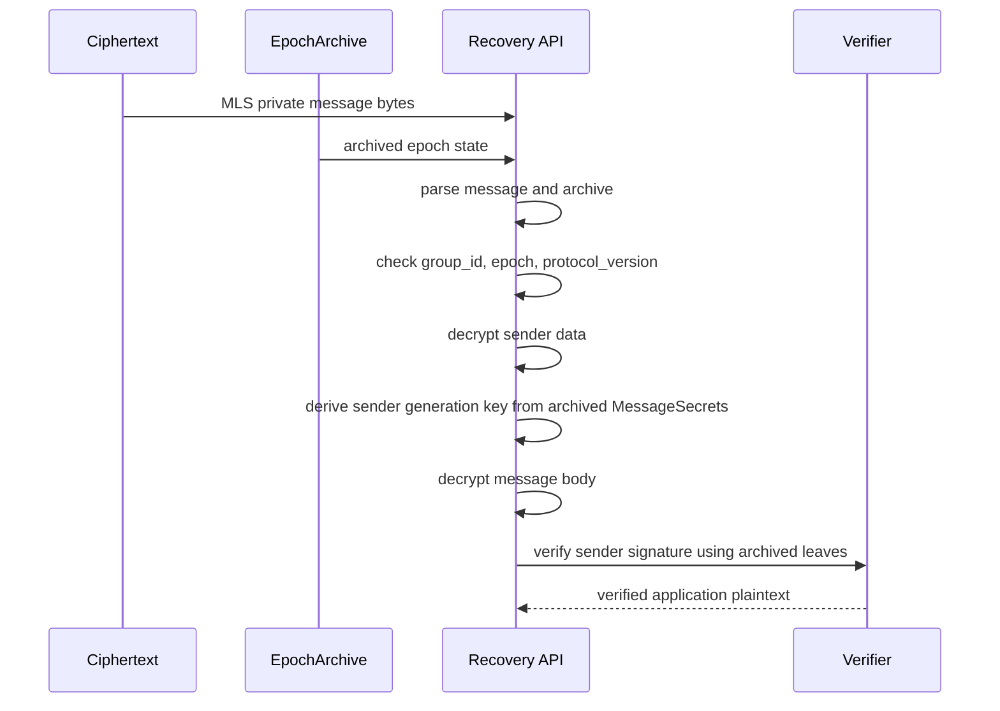
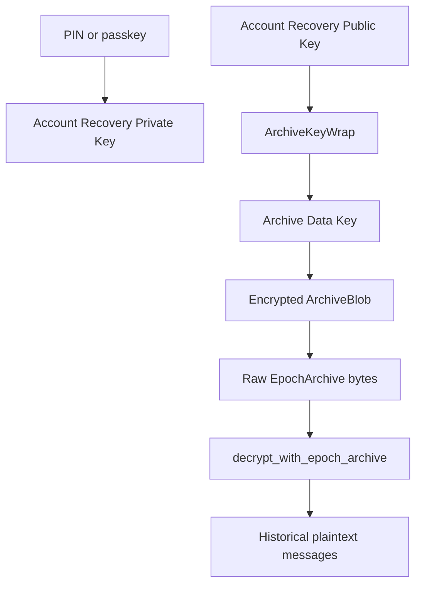
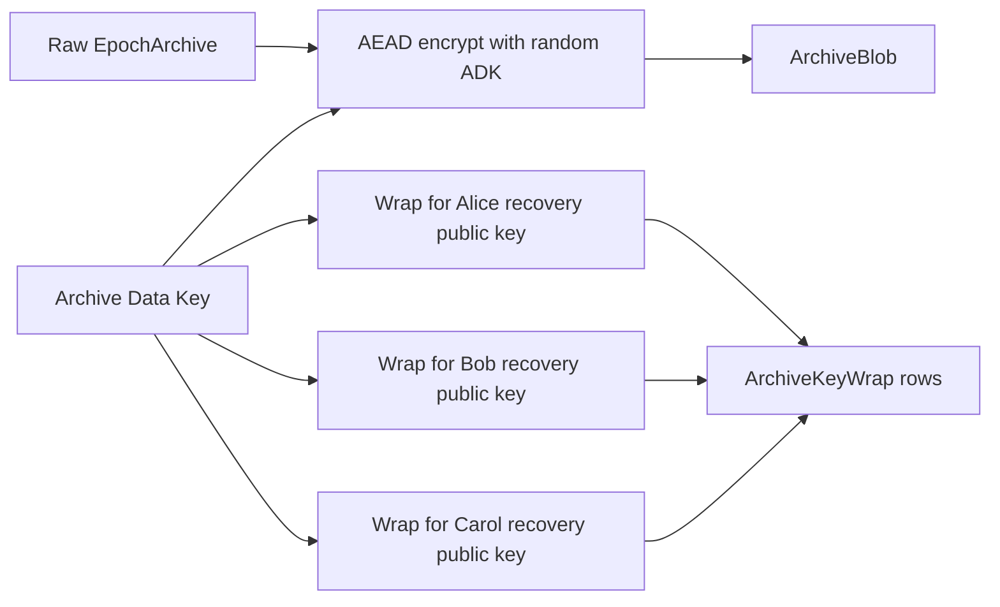
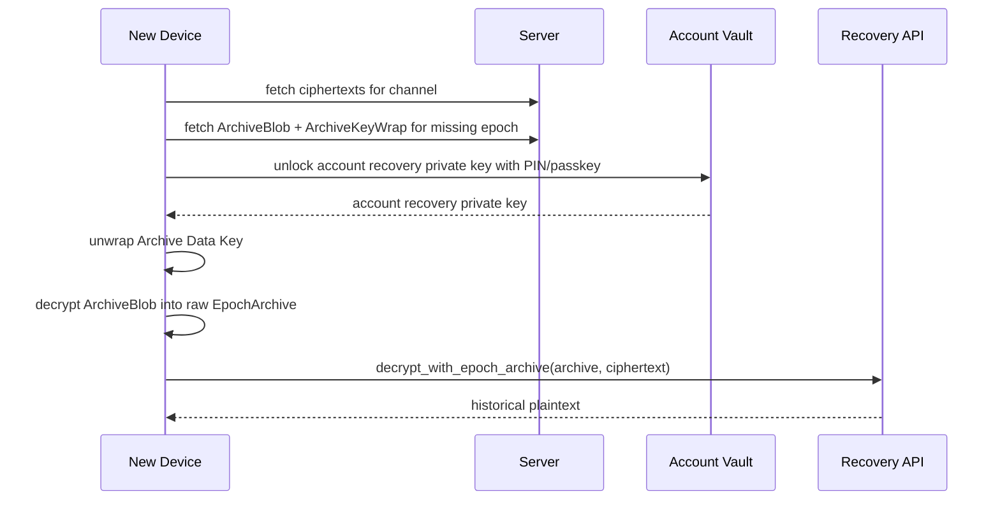
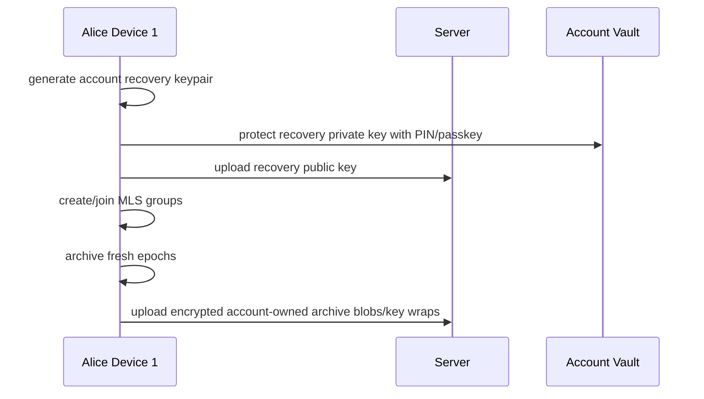

# PIN + Epoch Archive Research Notes

Status: research and POC design note.

Scope: summarize the current PIN + Epoch Archive discussion, the implemented OpenMLS/WASM/React POC, and the production design directions that are not implemented yet.

Source notes:

- Current working thread around `EPOCH_ARCHIVE_POC_PLAN.md`, `react-chat-v3`, and `react-chat-v4`.
- Referenced conversation id `019e1b16-477b-7f33-a29c-93b6bb476aa1` appears in local Codex session index as `Phan tich PIN Messenger`, but the raw transcript was not available under `.codex/sessions`. The Messenger/WhatsApp/Telegram analysis below is reconstructed from the conclusions re-discussed in the current thread.

## 1. Executive Summary

The chosen production direction is **Hybrid PIN Epoch Archive**:

```text
Primary path: account-owned archive
Fallback path: group-sponsored archive
Storage model: one encrypted archive blob + many small key wraps
```

The POC already proves that an MLS private message can be recovered from epoch-local archived secrets without the old live `MlsGroup` state. The PIN layer added in `react-chat-v3` and `react-chat-v4` demonstrates the application-level vault that protects archive bytes before they leave the device.

The important production correction is that a PIN should not directly encrypt every epoch archive. The recommended model is:

```text
PIN/passkey -> unlocks account recovery private key
account recovery private key -> unwraps archive data keys
archive data key -> decrypts encrypted epoch archive blob
epoch archive -> decrypts historical MLS ciphertext
```

This avoids re-encrypting all archives on PIN rotation and allows group-sponsored archives to be wrapped for offline users without knowing their PIN.

## 2. Implemented POC State

### Core OpenMLS

Implemented in `openmls/src/group/mls_group/epoch_archive.rs`:

- `MlsGroup::export_current_epoch_archive()`
- `decrypt_with_epoch_archive()`
- `peek_sender_data_from_archive()`
- `RecoveryDecryptOptions`
- `ArchivedPlaintext`
- `ArchivedSenderData`

The current archive contains:

```rust
archive_version
group_id
epoch
ciphersuite
protocol_version
sender_ratchet_config
message_secrets
leaves
own_leaf_index
```

The archive bytes are sensitive MLS key material. The WASM wrapper explicitly documents that applications must encrypt these bytes with a PIN/vault key before upload or persistence outside the device.

### Core Test Coverage

Implemented tests cover:

- historical decrypt after live state is dropped
- own sent message recovery, bypassing normal `CannotDecryptOwnMessage`
- recovery after live group moved past `max_past_epochs(5)`
- multiple messages in one epoch, sorted by sender generation
- out-of-order recovery using a fresh archive clone per message
- recovery-only `max_forward_distance` override
- recovery does not mutate live MLS group state

### WASM API

The WASM layer exposes:

```text
group.archive_current_epoch() -> Vec<u8>
peek_sender_data_from_archive(provider, archive, ciphertext)
decrypt_with_epoch_archive(provider, archive, ciphertext, allow_own_messages, max_forward_distance)
```

### React Demo v3

`react-chat-v3` is a scripted visual demo:

- Alice device 1 and Bob create old epoch 1 chat history.
- Alice device 1 creates a scripted PIN.
- Alice device 1 encrypts the epoch 1 archive into a PIN vault using WebCrypto.
- The group advances to epoch 9.
- Alice device 2 joins at epoch 10.
- Alice device 2 cannot live-decrypt epoch 1 ciphertext.
- Alice device 2 uses the PIN to unlock the encrypted vault record.
- Alice device 2 restores old epoch 1 messages from the unlocked archive.
- New epoch 10 messages still decrypt live on all devices.

The v3 PIN vault is demo-level:

```text
PBKDF2-SHA256 + AES-GCM-256
PIN directly derives the wrapping key
archive bytes are encrypted directly under the PIN-derived key
```

This is good enough to prove UX and data flow, but production should use an account recovery key layer.

### React Demo v4

`react-chat-v4` is interactive:

- Alice device 1 manually creates a PIN.
- Each device box has a text input and send button.
- Alice device 2 has a `Join Alice 2` action.
- Alice device 2 has a `Restore old messages` action that prompts for PIN.
- There is a `Key rotate` action that advances the MLS epoch via Alice device 1 self-update.
- If a PIN vault exists, `Key rotate` prompts for PIN and seals the new epoch archive into the vault.

This demo is useful for manual testing:

```text
send old messages at epoch 1
create PIN
join Alice 2 at epoch 10
restore old messages with PIN
send live messages after join
rotate epoch and continue sending
```

## 3. Why Epoch Archive Works

MLS application message decryption does not require the full old live `MlsGroup` state. It requires epoch-local material:

- group id
- epoch
- ciphersuite
- protocol version
- sender ratchet configuration
- message secrets
- sender membership/signature snapshot

The recovery flow is:


```mermaid
sequenceDiagram
    participant C as Ciphertext
    participant A as EpochArchive
    participant R as Recovery API
    participant V as Verifier

    C->>R: MLS private message bytes
    A->>R: archived epoch state
    R->>R: parse message and archive
    R->>R: check group_id, epoch, protocol_version
    R->>R: decrypt sender data
    R->>R: derive sender generation key from archived MessageSecrets
    R->>R: decrypt message body
    R->>V: verify sender signature using archived leaves
    V-->>R: verified application plaintext
```

Live OpenMLS state may discard old epoch secrets because of `max_past_epochs`. Archive recovery remains possible because the archive stores the epoch-local message secrets that live state no longer keeps.

## 4. PIN Vault: Demo vs Production

### Demo Model

The demos currently use:

```text
PIN -> PBKDF2 key -> AES-GCM encrypt raw epoch archive
```

This demonstrates the core product behavior:

- Alice device 1 creates a PIN.
- Alice device 1 seals archive bytes.
- Alice device 2 enters the same PIN.
- Alice device 2 unlocks archive bytes and restores old messages.

### Production Model

Production should use:

```text
PIN/passkey -> unlock Account Recovery Private Key
Account Recovery Public Key -> used by devices/sponsors to wrap Archive Data Keys
Archive Data Key -> encrypts one archive blob
```

Recommended key hierarchy:


```mermaid
flowchart TD
    PIN[PIN or passkey] --> ARK_PRIV[Account Recovery Private Key]
    ARK_PUB[Account Recovery Public Key] --> WRAP[ArchiveKeyWrap]
    ADK[Archive Data Key] --> BLOB[Encrypted ArchiveBlob]
    WRAP --> ADK
    BLOB --> RAW[Raw EpochArchive bytes]
    RAW --> RECOVER[decrypt_with_epoch_archive]
    RECOVER --> MSG[Historical plaintext messages]
```

Why this is better:

- PIN rotation only rewraps the account recovery private key.
- Group members can wrap archive access for Alice using Alice's public recovery key without knowing Alice's PIN.
- Archive blobs are encrypted once and shared through small key wraps.
- Device revoke and account recovery policy can be handled independently.

## 5. Chosen Production Direction: Hybrid

The chosen direction is **C Hybrid**:

```text
1. Try account-owned archive.
2. If missing, try group-sponsored archive.
3. If still missing, wait for old-device backfill or show a history gap.
```

### Account-Owned Archive

Alice's own device exports and uploads an archive for Alice's account.

```text
scope = account_owned
exporter_user_id = alice
recipient_user_id = alice
```

This is the primary path because ownership is clear and privacy reasoning is simpler.

Limitation:

If all Alice devices are offline from epoch 6 to epoch 10, Alice cannot produce account-owned archives for those epochs.

### Group-Sponsored Archive

An online group member can sponsor an archive for an epoch and wrap its archive data key for all eligible users.

Example:

```text
Bob is online at epoch 6.
Bob exports epoch 6 archive.
Bob encrypts archive bytes once with a random Archive Data Key.
Bob wraps that Archive Data Key for Alice, Bob, and other eligible users.
Alice device 4 later unlocks Alice's account recovery private key and unwraps the Archive Data Key.
```

This handles the offline gap case:

```text
Alice devices offline at epoch 5
current group epoch is 10
Alice device 4 logs in
account-owned archive exists only up to epoch 5
group-sponsored archives can cover epoch 6..10
```

If neither account-owned nor group-sponsored archive exists for an epoch, cryptographic recovery is impossible until an old authorized device backfills the missing archive.

## 6. GroupInfo, MemberSnapshot, and Recovery Storage

Keep the current Bellboy external-join mechanism unchanged.

Current Bellboy behavior:

```text
external join store: group_info:{cid}
write behavior: clear_room_messages(group_info:{cid}) + send latest GroupInfo
read behavior: query_n_latest_events(group_info:{cid}, 1)
API role: GET /v1/e2ee/channels/{type}/{id}/group_info for external join
```

This means each channel intentionally keeps only the latest GroupInfo. That is correct for external join because a joining device only needs a fresh authenticated group state to create an External Commit into the current epoch.

GroupInfo must not become the historical recovery store:

```text
latest GroupInfo at epoch 10
!=
verification material and MessageSecrets for epoch 1..9
```

A latest GroupInfo does not contain historical MLS message secrets, and using it as the only reference for old ciphertext verification is wrong because old epochs may have different leaf keys, credentials, membership, and tree state.

### Separate Recovery Storage

Recovery should use a separate storage surface from `group_info:{cid}`:

```text
latest_group_info          -> external join only, keep latest as today
member_snapshot_store      -> public verification material, content-addressed by hash
epoch_archive_blob_store   -> encrypted epoch-local MLS secret material
archive_key_wrap_store     -> small access grants to decrypt archive data keys
```

A production logical schema can be:

```text
LatestGroupInfo
- channel_id / cid
- mls_group_id
- epoch
- group_info_bytes
- updated_at
```

```text
MemberSnapshot
- snapshot_hash
- channel_id / cid
- mls_group_id
- first_seen_epoch / last_seen_epoch metadata, not part of snapshot_hash
- ciphersuite
- protocol_version
- public_tree_bytes or canonical member list
- member credential / signature-key material needed for recovery verification
- created_at
```

```text
EpochArchiveBlob
- archive_blob_id
- channel_id / cid
- mls_group_id
- epoch
- archive_scope: account_owned | group_sponsored
- exporter_user_id
- exporter_device_id
- member_snapshot_hash
- encrypted_archive_bytes
- aead_nonce
- created_at
```

```text
ArchiveKeyWrap
- archive_blob_id
- recipient_user_id
- recipient_recovery_key_id
- wrapped_archive_data_key
- wrap_alg
- readable_epoch_from
- readable_epoch_to
- created_at
```

### Storage Placement Choice

For `react-chat-v4` POC, do not add backend storage. Keep the demo local-only as it is today:

```text
latestGroupInfoStore       -> in-memory/browser-local only
memberSnapshotStore        -> in-memory/browser-local only
archiveBlobStore           -> in-memory/browser-local only
archiveKeyWrapStore        -> in-memory/browser-local only
```

For Bellboy production direction, prefer datastore/concierge-style K-V storage for MLS recovery material instead of PostgreSQL-first. The reason is pragmatic: Bellboy already treats MLS protocol state as a separate storage surface (`mls:{cid}` for protocol events, `group_info:{cid}` for latest GroupInfo), and recovery archive records are opaque binary protocol artifacts rather than relational business rows.

Current namespaces stay unchanged:

```text
mls:{cid}             -> persisted protocol events: commit/welcome/proposal/external_commit
group_info:{cid}      -> latest GroupInfo only, overwritten for external join
```

Add a separate recovery namespace:

```text
mls:archive:{cid}     -> recovery archive K-V namespace for this channel
```

If any Bellboy component later treats `mls:*` as a broad subscription pattern, use `mls_archive:{cid}` instead. With the current exact room construction (`format!("mls:{cid}")`), `mls:archive:{cid}` is distinct and should not collide with protocol event sync.

Recommended K-V shape inside `mls:archive:{cid}`:

```text
snapshot:{snapshot_hash}
  -> MemberSnapshot bytes

blob:{epoch}:{scope}:{archive_blob_id}
  -> EpochArchiveBlob metadata + encrypted_archive_bytes

wrap:{recipient_user_id}:{epoch}:{recovery_key_id}:{archive_blob_id}
  -> ArchiveKeyWrap bytes

index:epoch:{epoch}
  -> list of archive_blob_id candidates for that epoch

index:recipient_epoch:{recipient_user_id}:{epoch}
  -> list of wrap references the user may try for that epoch
```

If the selected datastore supports efficient prefix/range scans, the index keys can be thinner. If it only supports `get/put/remove` style K-V access, keep explicit index entries so restore does not require scanning the whole channel archive namespace.

Do not put recovery archives into `mls:{cid}`. That room is for ordered protocol sync and may have different retention/TTL semantics. Recovery blobs need longer retention, recipient-specific access lookup, and idempotent upload behavior.

The first backend implementation should therefore be:

```text
POC: no backend; local in-memory stores only
Production direction: datastore/concierge K-V namespace mls:archive:{cid}
PostgreSQL: optional later only for audit/index/reporting if K-V lookup is insufficient
```

### MemberSnapshot Reference

The current POC archive stores `leaves: Vec<Member>` directly. That is acceptable for proving recovery but too expensive for large groups and repeated epochs.

Production should split the data:

```text
EpochArchiveSecret
- group_id
- epoch
- ciphersuite
- protocol_version
- sender_ratchet_config
- message_secrets
- own_leaf_index
- member_snapshot_hash
```

```text
MemberSnapshot
- snapshot_hash
- group_id
- snapshot_version
- public verification data
- first_seen_epoch / last_seen_epoch metadata, not part of snapshot_hash
```

Restore then becomes:

```text
1. find ciphertext epoch
2. find an eligible ArchiveKeyWrap for the recovering account
3. unwrap Archive Data Key
4. decrypt EpochArchiveBlob
5. read member_snapshot_hash from archive metadata/AAD
6. fetch MemberSnapshot by hash
7. decrypt ciphertext with archived MessageSecrets
8. verify sender signature against the referenced MemberSnapshot
```

### Reuse Optimization, Done Safely

The optimization is not "reuse because the commit probably did not change members". That shortcut is unsafe because self-update, external join, remove, add, and credential/key rotations can change the public verification inputs used by recovery.

The safe check is content-addressing:

```text
snapshot_hash = SHA-256(canonical_recovery_verification_snapshot_bytes)
reuse MemberSnapshot only if snapshot:{snapshot_hash} already exists
otherwise store a new MemberSnapshot
```

Important detail: do not include `epoch` in the reusable snapshot hash. If epoch is included, every commit creates a different hash and reuse becomes impossible. The epoch is instead bound in the encrypted archive metadata/AAD:

```text
Archive AAD = Hash(channel_id, group_id, epoch, scope, exporter_device_id, snapshot_hash, archive_version)
MemberSnapshot hash = Hash(public verification material only)
```

So the archive still says "this secret material is for epoch N", while the snapshot can be reused across epochs whose public verification material is byte-identical.

#### Optimized POC Hash

`react-chat-v4` now uses the optimized hash in the POC itself. The local recovery store computes a WebCrypto SHA-256 over canonical member verification material and intentionally excludes both `epoch` and `encryption_key`:

```text
canonical_snapshot_v2 = canonical_json({
  snapshot_version: 2,
  hash_mode: optimized-member-signatures,
  group_id,
  protocol_version,
  ciphersuite,
  signature_scheme,
  members: sort_by_leaf_index([
    {
      leaf_index,
      user_id_or_credential_bytes,
      signature_key
    }
  ])
})

snapshot_hash = sha256(canonical_snapshot_v2)
```

This gives the POC the behavior production wants to study: self-update/key-rotation epochs can reuse the same `MemberSnapshot` if the member leaf identity and signature verification keys did not change. The raw Rust archive still contains `leaves` internally for the current recovery API, but the POC storage metadata already models the split `member_snapshot_hash` design.

Check in code:

```ts
const snapshotBytes = canonicalizeRecoverySnapshot(
  group.members(),
  group.groupId()
);
const snapshotHash = await sha256Hex(snapshotBytes);

if (memberSnapshotStore.has(snapshotHash)) {
  log(`MemberSnapshot reused: ${snapshotHash.slice(0, 12)}`);
} else {
  memberSnapshotStore.set(snapshotHash, { snapshotHash, snapshotBytes, epoch });
  log(`MemberSnapshot stored: ${snapshotHash.slice(0, 12)}`);
}
```

#### Production Hash API Follow-Up

The remaining production follow-up is to expose the same canonical snapshot format from OpenMLS/WASM instead of duplicating canonicalization logic in React.

With the current POC recovery code in `epoch_archive.rs`, decrypt/verify uses:

```text
archive.group_id
sender leaf_index
sender signature_key
archive.ciphersuite.signature_algorithm()
archive.protocol_version
archive.message_secrets
```

`message_secrets` are private and stay in `EpochArchiveBlob`. The reusable public verification snapshot can stay narrow, but production should move canonical encoding into OpenMLS/WASM so all clients compute identical hashes. A later Rust-side `RecoveryMemberSnapshot` API can remove the remaining mismatch where the raw POC archive still serializes full `Member` leaves.

#### Fresh-Epoch Hook

Every fresh epoch should run the same logic:

```text
1. merge/create/join commit
2. export latest GroupInfo and overwrite group_info:{cid}
3. build canonical recovery verification snapshot from the post-merge group
4. compute snapshot_hash
5. check mls:archive:{cid} / snapshot:{snapshot_hash}
6. store snapshot only if absent
7. export current EpochArchiveSecret and attach member_snapshot_hash
8. encrypt archive blob with random Archive Data Key
9. store blob:{epoch}:{scope}:{archive_blob_id}
10. store wrap/index records for eligible recovery keys
```

In the POC log, show both the decision and the reason when possible:

```text
MemberSnapshot reused hash=abc123 epoch=8 reason=same canonical members
MemberSnapshot stored hash=def456 epoch=9 reason=leaf 2 signature_key changed
MemberSnapshot stored hash=789abc epoch=10 reason=leaf 3 added for alice-device-2
```

The reason can be computed by diffing the previous canonical snapshot against the new one by `leaf_index` and field name. This diff is for operator/debug visibility only; the cryptographic decision is still the hash equality check.

#### Reuse Test Matrix

```text
send application message only
  -> no new epoch, no snapshot check

key rotate / self update
  -> conservative v1 usually changes because encryption_key changes
  -> optimized v2 may reuse if leaf_index + credential + signature_key are unchanged

Alice device 2 external join
  -> new leaf appears, snapshot_hash changes

remove member
  -> leaf set changes, snapshot_hash changes

remove then re-add same user
  -> snapshot may or may not match depending leaf/signature material
  -> access is still controlled by ArchiveKeyWrap membership intervals, not by snapshot hash alone

server returns wrong snapshot for archive
  -> snapshot_hash mismatch with archive metadata/AAD or signature verification fails
```

## 7. One Archive Blob + Many Key Wraps

The storage model should avoid:

```text
epochs x users x devices x full_archive_blob
```

For a group with 1000 users and 3 devices each, that naive model becomes:

```text
epochs x 3000 full archive records
```

Instead use:

```text
few encrypted archive blobs per channel/epoch
+
many small key wraps per eligible user/account
```

### Logical Schema

```text
ArchiveBlob
- archive_blob_id
- channel_id
- mls_group_id
- epoch
- archive_version
- archive_scope: account_owned | group_sponsored
- exporter_user_id
- exporter_device_id
- exporter_leaf_index
- member_snapshot_hash
- encrypted_archive_bytes
- aead_nonce
- created_at
```

```text
ArchiveKeyWrap
- archive_blob_id
- recipient_user_id
- recipient_recovery_key_id
- wrapped_archive_data_key
- wrap_alg
- readable_epoch_from
- readable_epoch_to
- created_at
```

### Encryption Flow


```mermaid
flowchart LR
    RAW[Raw EpochArchive] --> ENC[AEAD encrypt with random ADK]
    ADK[Archive Data Key] --> ENC
    ENC --> BLOB[ArchiveBlob]

    ADK --> W1[Wrap for Alice recovery public key]
    ADK --> W2[Wrap for Bob recovery public key]
    ADK --> W3[Wrap for Carol recovery public key]

    W1 --> KWRAPS[ArchiveKeyWrap rows]
    W2 --> KWRAPS
    W3 --> KWRAPS
```

AEAD AAD should bind at least:

```text
channel_id
mls_group_id
epoch
archive_version
archive_scope
exporter_user_id
exporter_device_id
member_snapshot_hash
```

This prevents server-side archive swapping across channels, epochs, or recipients.

### Restore Flow


```mermaid
sequenceDiagram
    participant D as New Device
    participant S as Server
    participant V as Account Vault
    participant R as Recovery API

    D->>S: fetch ciphertexts for channel
    D->>S: fetch ArchiveBlob + ArchiveKeyWrap for missing epoch
    D->>V: unlock account recovery private key with PIN/passkey
    V-->>D: account recovery private key
    D->>D: unwrap Archive Data Key
    D->>D: decrypt ArchiveBlob into raw EpochArchive
    D->>R: decrypt_with_epoch_archive(archive, ciphertext)
    R-->>D: historical plaintext
```

### Race Behavior

If Alice has 3 devices online and all upload for the same user/channel/epoch:

```text
first valid upload -> primary
later uploads -> 200 already_satisfied or stored_as_alternate
```

Do not hard reject later uploads as errors. The server cannot decrypt archives, so the first upload may be corrupt or wrapped incorrectly. Keeping a small number of alternates improves recovery reliability.

## 8. Membership Policy

Archive access must be based on membership intervals, not just `user_id`.

Example:

```text
Alice joined at epoch 1
Alice removed at epoch 7
Alice re-added at epoch 12
```

Alice can read:

```text
epoch 1..7
epoch 12..
```

Alice must not get key wraps for:

```text
epoch 8..11
```

The production system needs a policy engine that answers:

```text
can_user_restore_epoch(user_id, channel_id, epoch) -> bool
```

Key wrapping must use this policy before creating `ArchiveKeyWrap` rows.

## 9. Bad Cases To Design For

### Upload Race

Multiple devices upload archives for the same user/channel/epoch.

Expected behavior:

```text
primary already exists -> return success/idempotent response
optionally keep alternate archive candidates
never treat later uploads as fatal client errors
```

### Corrupt First Archive

The first archive might be bad:

- upload truncated
- wrong AAD
- wrong recipient key
- client bug
- local state bug

Mitigation:

```text
keep primary + small alternate set
try alternates on restore failure
validate group_id/epoch/signature during recovery
```

### Missing Archive Gap

There can be ciphertext for epoch N but no archive for epoch N.

Expected UX:

```text
show history gap for epoch N
retry later
wait for old-device backfill
```

Do not present PIN as a magic recovery secret. PIN unlocks vault keys; it cannot recreate MLS epoch secrets that were never archived.

### All User Devices Offline

If Alice devices are offline from epoch 5 to 10, account-owned archive can only restore up to epoch 5.

To restore epoch 6..10 immediately, production needs group-sponsored archives created by online members.

Without group-sponsored archives:

```text
Alice device 4 must wait for an old Alice device to come online and backfill
or accept partial history
```

### Old Device Backfill

When an old Alice device comes back online:

```text
process pending commits in order
after each merge, export fresh epoch archive
upload missing archive records
retry upload until acknowledged
```

This requires a durable local upload queue.

### Wrong PIN and Brute Force

PIN-backed recovery must handle:

- wrong PIN
- repeated attempts
- online/offline brute force
- lockout and backoff
- recovery-code/passkey fallback

Production should prefer:

```text
PIN/passkey -> unlock account recovery private key
```

rather than:

```text
PIN -> directly encrypt every archive
```

### PIN Rotation

Changing PIN should not re-encrypt all archive blobs.

Correct model:

```text
old PIN unlocks account recovery private key
new PIN rewraps account recovery private key
archive blobs and ArchiveKeyWrap rows remain unchanged
```

### Device Revoke

Device revoke and account history recovery are separate policies.

After revoking Alice device 2:

```text
device 2 should not receive future live secrets
device 2 should not access future vault unwrap material
old history already on device 2 may need local wipe policy
Alice account may still keep old history access
```

### User Removed and Re-Added

If a user is removed and later re-added, access must have a gap.

Do not create key wraps solely because `recipient_user_id` matches. Use membership intervals.

### Large Member Snapshot

The POC archive stores `leaves: Vec<Member>`. For large groups, repeating the full member snapshot in every archive is too expensive.

Production should split:

```text
EpochArchiveKeyMaterial
- message_secrets
- sender_ratchet_config
- own_leaf_index
- member_snapshot_hash

MemberSnapshot
- snapshot_hash
- leaves / tree / credential data
```

Archives reference a snapshot hash instead of duplicating full leaves every time.

### Out-of-Order Recovery

The POC uses a fresh archive clone per message, making out-of-order recovery safe.

Production batch recovery should:

```text
group messages by sender leaf + content type
sort by generation
decrypt sequentially
```

or keep generation checkpoints.

### Forward Distance

If a sender emits many messages in one epoch, recovery can exceed sender ratchet `maximum_forward_distance`.

Options:

```text
use recovery-only max_forward_distance override
rotate epochs more often
store generation checkpoints
batch decrypt in generation order
```

### Server Archive Swap

A malicious or buggy server might return:

- archive from another channel
- archive from another epoch
- key wrap for another user
- old archive version

Mitigation:

```text
bind metadata into AEAD AAD
check archive group_id and epoch inside recovery API
verify sender signatures after decrypt
```

### Sponsor Trust

A group-sponsored archive exporter was a legitimate member for that epoch, so the exporter already had the epoch secrets. Sponsorship does not grant the sponsor new access.

However, sponsors can upload garbage. Restore must verify and try alternates.

### Ciphertext Retention Mismatch

Archive without ciphertext cannot restore messages.

Ciphertext without archive cannot restore messages.

Retention should be aligned:

```text
message retention >= archive retention
archive retention >= expected restore window
```

## 10. Messenger, WhatsApp, Telegram Comparison

### Messenger / Facebook

Messenger-like design is closest to the PIN vault direction:

```text
E2EE chat state
+
Secure Storage / recovery PIN / recovery code / platform-backed recovery
```

Mapping:

```text
Messenger Secure Storage
~ encrypted account history/key backup
~ PIN/recovery code/passkey unlock
~ server stores encrypted backup material
```

### WhatsApp

WhatsApp uses two relevant ideas:

```text
linked device history transfer from primary device
end-to-end encrypted cloud backups protected by password, recovery key, or passkey
```

Mapping:

```text
linked-device history transfer ~ old device actively supplies recent history
encrypted backup ~ account-owned archive/backup path
```

If there is no backup and no old device, a new device cannot reconstruct old E2EE history.

### Telegram

Telegram separates models:

```text
Cloud Chats: convenient multi-device cloud sync, not the same strict E2EE model
Secret Chats: E2EE, device-bound, not cloud-synced
```

Mapping:

```text
Telegram Cloud Chats avoid the MLS-style restore problem by not using the same E2EE semantics.
Telegram Secret Chats choose stronger device-local E2EE but give up seamless multi-device history restore.
```

For Bellboy/OpenMLS, the intended direction is closer to Messenger/WhatsApp E2EE backup, not Telegram cloud chat.

## 11. Recommended Product Flow

### New Account or First Device


```mermaid
sequenceDiagram
    participant D1 as Alice Device 1
    participant S as Server
    participant V as Account Vault

    D1->>D1: generate account recovery keypair
    D1->>V: protect recovery private key with PIN/passkey
    D1->>S: upload recovery public key
    D1->>D1: create/join MLS groups
    D1->>D1: archive fresh epochs
    D1->>S: upload encrypted account-owned archive blobs/key wraps
```

### Fresh Epoch Hook

Run archive export immediately after a fresh epoch is created:

```text
group create
join with welcome
own commit merge: add/remove/key rotation
received commit merge
external join after merge
```

Client flow:

```text
merge commit
export_current_epoch_archive
encrypt archive blob with random Archive Data Key
wrap Archive Data Key for account recovery key
enqueue upload
retry until acknowledged
```

### New Device Restore

```text
1. new device authenticates as Alice
2. new device joins current MLS group state
3. user enters PIN/passkey
4. client unlocks account recovery private key
5. client downloads missing ciphertexts
6. for each ciphertext epoch:
   - try account-owned archive
   - else try group-sponsored archive
   - else mark history gap
7. decrypt archive blob
8. call decrypt_with_epoch_archive
9. render restored history
```

## 12. Implementation Roadmap

### Already Done

- Core OpenMLS archive export and recovery decrypt POC.
- Rust test coverage for major archive recovery cases.
- WASM wrapper for archive export/recovery.
- `react-chat-v3` scripted PIN vault demo.
- `react-chat-v4` interactive demo with manual PIN, join, restore, chat boxes, and key rotation.

### Next Recommended Work

1. Stable archive format:

   - replace JSON archive with stable binary encoding if size/performance matters
   - include explicit archive metadata and snapshot hash

2. Client vault model:

   - introduce account recovery keypair
   - PIN/passkey wraps recovery private key
   - archive blobs use random Archive Data Keys

3. Bellboy recovery storage design:

   - keep current `group_info:{cid}` latest-only storage for external join
   - use local in-memory/browser stores for `react-chat-v4`; no backend needed for the POC
   - production direction: use datastore/concierge K-V namespace such as `mls:archive:{cid}`
   - store `MemberSnapshot` records under `snapshot:{snapshot_hash}`
   - store encrypted `ArchiveBlob` records under `blob:{epoch}:{scope}:{archive_blob_id}`
   - store `ArchiveKeyWrap` records under `wrap:{recipient_user_id}:{epoch}:{recovery_key_id}:{archive_blob_id}`
   - keep explicit epoch/recipient indexes if the K-V layer cannot prefix-scan efficiently
   - upload idempotency by `(channel_id, epoch, scope, exporter_device_id)` and snapshot hash
   - alternate archive candidates for corrupt/missing sponsored archives
   - membership policy checks based on epoch membership intervals

4. Durable upload queue:

   - archive export after every fresh epoch
   - local retry until server ack
   - backfill when old devices reconnect

5. Group-sponsored archives:

   - exporter selection policy
   - eligible recipient list by epoch membership
   - key wrapping to account recovery public keys

6. Restore client:

   - missing epoch detection
   - account-owned then group-sponsored fallback
   - partial history rendering
   - wrong PIN and retry UX

## 13. React Chat V4 POC Implementation Plan

Goal: extend `react-chat-v4` from an interactive PIN-vault demo into a storage-shape POC that mirrors the production design while still running entirely in the browser.

### POC Scope

Use browser-local/in-memory stores only for this POC. These stores mimic production recovery records but do not call Bellboy/datastore yet:

```text
latestGroupInfoStore
memberSnapshotStore
archiveBlobStore
archiveKeyWrapStore
```

Do not change Bellboy backend for this POC. Do not change OpenMLS core unless the current archive format blocks the demo. If the Rust archive still contains `leaves`, the React POC can still simulate `member_snapshot_hash` as metadata around the archive blob and document that production will split it.

### UI Changes

Add a recovery storage panel:

```text
latest GroupInfo epoch
MemberSnapshot count
ArchiveBlob count
ArchiveKeyWrap count
missing epoch count for Alice device 2
```

Keep the current chat boxes:

```text
Alice device 1 chat box
Alice device 2 chat box
Bob device 1 chat box
```

Keep existing actions and add storage visibility:

```text
Alice device 1: create PIN manually
Alice device 2: join current group
Alice device 2: restore old messages -> prompt PIN
All devices: send messages normally
Global: key rotate to advance epoch
Optional: Bob sponsor archive for current epoch
```

Protocol log should explicitly show:

```text
latest GroupInfo overwritten at epoch N
MemberSnapshot hash computed
MemberSnapshot reused or stored
ArchiveBlob stored for epoch N
ArchiveKeyWrap stored for Alice recovery key
restore tried account-owned archive
restore tried group-sponsored archive
restore failed because archive/key wrap/PIN/snapshot was missing
```

### POC Data Structures

```ts
type LatestGroupInfoRecord = {
  channelId: string;
  epoch: number;
  groupInfoBytes?: Uint8Array;
  updatedByDevice: string;
};
```

```ts
type MemberSnapshotRecord = {
  snapshotHash: string;
  channelId: string;
  epoch: number;
  snapshotBytes: Uint8Array;
};
```

```ts
type ArchiveBlobRecord = {
  archiveBlobId: string;
  channelId: string;
  epoch: number;
  scope: "account_owned" | "group_sponsored";
  exporterUserId: string;
  exporterDeviceId: string;
  memberSnapshotHash: string;
  encryptedArchiveBytes: Uint8Array;
  nonce: Uint8Array;
};
```

```ts
type ArchiveKeyWrapRecord = {
  archiveBlobId: string;
  recipientUserId: string;
  recoveryKeyId: string;
  wrappedArchiveDataKey: Uint8Array;
};
```

For the POC, `wrappedArchiveDataKey` may be simulated with PIN-derived wrapping, clearly labeled as a stand-in. Production should use `PIN/passkey -> account recovery private key -> unwrap Archive Data Key`.

### Epoch Hook Behavior

After every fresh epoch event:

```text
1. update latestGroupInfoStore, replacing the previous value
2. compute a canonical-ish MemberSnapshot byte array
3. hash it with SHA-256
4. insert MemberSnapshot only if the hash is absent
5. call archive_current_epoch()
6. encrypt archive bytes as an ArchiveBlob
7. create ArchiveKeyWrap for Alice if PIN vault/recovery key exists
8. optionally create Bob/group-sponsored wraps for sponsored demo cases
```

Fresh epoch events in the POC:

```text
initial setup
Alice device 2 external join
manual key rotate
future add/remove/update test hooks
```

### Restore Algorithm In V4

For each old ciphertext Alice device 2 cannot live-decrypt:

```text
1. group by ciphertext epoch
2. try account_owned archive for Alice
3. if missing, try group_sponsored archive for Alice
4. if archive exists, prompt PIN and unwrap/decrypt
5. fetch MemberSnapshot by member_snapshot_hash
6. decrypt with decrypt_with_epoch_archive()
7. render restored message with source label
8. if all candidates fail, render a history gap for that epoch
```

The UI should label recovery source:

```text
live MLS decrypt
restored via Alice account archive
restored via Bob sponsored archive
missing archive for epoch N
wrong PIN
```

### Manual Verification Scenarios

```text
1. create PIN, send epoch 1 messages, join Alice device 2, restore via account-owned archive
2. key rotate, confirm latest GroupInfo epoch increases and archive count increases
3. Bob sponsors archive for current epoch, Alice device 2 restores through sponsored fallback
4. wrong PIN fails without corrupting state
5. rotate multiple times and confirm optimized MemberSnapshot is reused when `leaf_index + user_id + signature_key` stay unchanged
```

Build verification:

```bash
cd openmls-wasm/static/react-chat-v4
npm run build
```

## 14. Open Research Questions

- Should the production namespace be exactly `mls:archive:{cid}`, or `mls_archive:{cid}` to avoid any future `mls:*` subscription ambiguity?
- Does the chosen datastore support prefix/range scans, or do we need explicit `index:epoch:*` and `index:recipient_epoch:*` K-V records?
- What exact canonical MemberSnapshot encoding should OpenMLS expose so `snapshot_hash` is stable across WASM, UniFFI, and native clients?
- Can production `RecoveryMemberSnapshot` safely exclude leaf encryption keys and keep only `leaf_index + credential + signature_key`?
- Should group-sponsored archives be mandatory for every epoch, or opportunistic fallback?
- How many alternate archives should be retained per `(channel_id, epoch, scope)`?
- Should member snapshots be full snapshots, deltas, or references to server-side MLS tree state?
- What is the retention policy for archives vs ciphertext?
- How should user removal/re-addition be represented in archive key wrap policy?
- What KDF/passkey/HSM model should protect account recovery private keys in production?
- Should mobile clients use platform keystore plus PIN, passkey-only, or both?
- How should backup recovery behave when the user loses PIN/passkey and all devices?

## 15. Final Recommendation

Use the hybrid design:

```text
account-owned archive is primary
group-sponsored archive fills offline gaps
one encrypted archive blob is shared through many small key wraps
latest GroupInfo remains latest-only and serves external join, not recovery
recovery uses separate `mls:archive:{cid}`-style storage for MemberSnapshot + ArchiveBlob + ArchiveKeyWrap
PIN/passkey unlocks account recovery private key
raw MLS archive bytes never leave a device unencrypted
```

This gives a practical UX close to Messenger/WhatsApp-style secure storage while keeping MLS/E2EE semantics clear: a new device can only restore epochs for which an authorized archive was actually produced and wrapped for that account.

## 16. Progress Log

### 2026-05-14 — POC — Optimized Snapshot Reuse In React Chat V4

Goal: implement the optimized MemberSnapshot reuse strategy directly in `react-chat-v4`, instead of leaving it as production-only design text.

Code changed:

- `openmls-wasm/static/react-chat-v4/src/App.tsx`
  - added local recovery K-V POC state: latest GroupInfo metadata, MemberSnapshot records, ArchiveBlob records, and ArchiveKeyWrap records
  - added optimized snapshot canonicalization using `leaf_index + user_id + signature_key`, excluding `epoch` and `encryption_key`
  - computes `snapshot_hash` with WebCrypto SHA-256
  - logs whether a MemberSnapshot is stored or reused, including a diff reason for new snapshots
  - archives each fresh epoch during setup, epoch advancement, Alice 2 join, and manual key rotation
  - records PIN-created key wraps for Alice account-owned archive blobs
  - adds a Recovery K-V POC status card showing namespace, latest GroupInfo epoch, snapshot count, blob count, wrap count, and latest snapshot hash
- `openmls-wasm/static/react-chat-v4/src/index.css`
  - expanded the state strip and styled the Recovery K-V POC card

Design decision:

- Keep POC backend-free and local-only.
- Use `mls:archive:{cid}` as the displayed production-like namespace.
- Use optimized snapshot hash in the POC now; leave Rust/OpenMLS canonical snapshot export as a production follow-up.

Rejected alternative:

- Conservative POC hash including `encryption_key`; rejected because it hides the reuse behavior we want to inspect during key rotation.

Verification:

```bash
cd openmls-wasm/static/react-chat-v4
npm run build
npm run dev -- --host 127.0.0.1
```

Result: production build passed and the dev server started at `http://127.0.0.1:5176/`.

### 2026-05-14 — POC — Multi-Epoch PIN Backfill And Restore Fix

Goal: fix a `react-chat-v4` POC gap found from manual logs where Alice created the PIN after sending epoch 3 messages, but Alice device 2 restore only displayed epoch 1 history.

Observed log diagnosis:

- Epoch 3 was not missing cryptographically. The log showed `ArchiveBlob stored ... account_owned:alice1:epoch-3` before Alice 2 joined.
- The POC bug was UI/vault flow: `createPin()` only sealed `actors.alice1.archives[1]`, and `restoreAlice2()` only filtered `message.epoch === 1`.
- Therefore epoch 3 messages existed and had archives, but no PIN vault record was created/restored for epoch 3 when the PIN was created late.

Code changed:

- `openmls-wasm/static/react-chat-v4/src/App.tsx`
  - `createPin()` now backfills all existing Alice device 1 archives into the PIN vault, sorted by epoch.
  - `createPin()` creates local `ArchiveKeyWrap` records for each sealed epoch.
  - `restoreAlice2()` now restores all pre-join message epochs with available PIN vault records, not just epoch 1.
  - Restore logs now show the unlocked epochs and restored message epoch explicitly.
  - The Restore button enables when Alice 2 has any pre-join ciphertexts, not only epoch 1 ciphertexts.
  - Key-rotate PIN verification now uses the first available vault record instead of hard-coding `vault.records[1]`.

Design decision:

- Keep the demo account-owned archive path local-only, but make delayed PIN creation behave like an old device backfill: all already-exported Alice archives become sealed and restorable once the PIN is created.

Verification:

```bash
cd openmls-wasm/static/react-chat-v4
npm run build
```

Result: production build passed.

### 2026-07-15 — Production — External SDK and Standalone App Boundary

Goal: create an outsource-safe UHM Chat distribution that keeps live MLS/E2EE while removing the account PIN and remote encrypted-history feature set from the JavaScript/React contract.

Code changed:

- `ermis-chat-monorepo` now has an internal `outsource` branch based on `uhm-chat@974eb5b`.
- Core SDK removes the PIN/vault/archive API client, runtime manager orchestration, IndexedDB stores, public request/types, channel recovery policy, and archive-backed message repair. Device-local protocol replay/reset remains available.
- React SDK removes `useRecoveryPin`, PIN components/styles/exports, recovery-policy controls, and archive upload calls.
- Both packages use `2.1.0-external.1`; React pins the exact core version. External builds disable source maps, and the React tarball no longer publishes `/src`.
- `uhm-chat-external` is a standalone app repository boundary with exact SDK versions, sanitized UI/locales, `.env.example`, no workspace aliases, and no public OpenMLS glue/declaration copies.
- The app still uses ordered `connectUser → initialize E2EE → mount chat`, key rotation, external join/sync, encrypted attachments/media, and live state replay/reset.

Design decisions:

- The current OpenMLS WASM binary and its generated glue remain a temporary internal exception. The binary checksum and size are unchanged; `loadOpenMlsWasm()` exposes a narrowed live-only TypeScript view. A user-owned follow-up (`WASM-001`) will replace the artifact.
- Outsource receives only the standalone app source and compiled npm packages, not this monorepo or SDK TypeScript source.
- Bellboy, SQL, Postman, and API contracts are unchanged in this phase. `bellboy-external` attachment/base64 work stays blocked until the FE/SDK release is complete.
- Registry lockfile generation and the app's one-commit Git initialization must wait for a successful npm publish; they are not simulated with tarball locators.

Verification:

- Core SDK and React SDK production builds passed.
- External contract tests confirmed no high-level encrypted-history exports, declarations, manager methods, policy field, or endpoint strings; attachment and media suites passed.
- `npm pack` and `scripts/publish-packages.sh --tag external --dry-run` passed with no `/src` or source maps. React depends exactly on core `2.1.0-external.1`.
- A standalone copy installed both local package tarballs and completed a production build outside the monorepo.
- OpenMLS WASM SHA-256 remained `2ce2c8b1e726a6c220fa44dfb2913830d82ef7f7ed13321abe830e8a1eeb7109` at 2,494,458 bytes.
- Real npm publish did not start because `npm whoami` returned `E401 Unauthorized`; no registry package was changed.

### 2026-06-19 — Production — PIN Settings Restore Diagnostics

Goal: move terminal unavailable-history warnings out of individual Uhm Chat channels and into the account-level Chat history PIN settings dialog.

Code changed:

- `packages/ermis-chat-sdk/src/encryption/types.ts` and `manager.ts`
  - added `RecoveryStatus.restoreProgressWithIssues`.
  - `getRecoveryStatus()` now returns normalized incomplete and done-with-gap restore progress records, while keeping the existing CID arrays for compatibility.
- `packages/ermis-chat-react/src/hooks/useRecoveryPin.ts`
  - surfaces `restoreProgressWithIssues` through `recoveryStatus`.
- `apps/uhm-chat/src/features/chat/UhmRecoveryPinDialog.tsx`
  - renders a compact "Some history unavailable" panel in account PIN settings above Change PIN.
  - the Details dropdown groups affected channels and shows message count, epochs, and primary reason.
- `apps/uhm-chat/src/pages/ChatPage.tsx`
  - removed permanent-gap channel header badges and timeline warning banners.
  - running/pending restore progress still stays visible in the active channel.
- `apps/uhm-chat/src/locales/en.json` and `vi.json`
  - added localized PIN-settings diagnostics copy.
- SDK, React, and Uhm README files document the new status field and UX behavior.

Design decisions:

- Keep permanent/unavailable history in one account-level recovery surface so users do not see the same warning repeated across channels.
- Keep `getRestoreProgress(channelType, channelId)` for selected-channel progress and repair flows; use `restoreProgressWithIssues` for global settings diagnostics.
- This is an additive client-side SDK/UI contract. Bellboy API, SQL, Postman collection, and server event semantics are unchanged.

Performance:

- `getRecoveryStatus()` remains `O(I + G)` time and memory for incomplete restore records `I` and done-with-gap records `G`.
- IndexedDB access stays at the existing local incomplete/gap status-index reads.
- No network requests, server database round trips, server payload growth, hot partitions, or backend contention are added.

Verification:

- `npm run build:sdk` passed.
- `npm run build:react` passed.
- `yarn workspace uhm-chat build` passed.
- `yarn workspace @ermis-network/ermis-chat-sdk test:repair` passed.

### 2026-06-14 — Production — Archive-First Repair and Group-Sponsored Archive

Goal: close recovery gaps when every device of a recipient is offline during epoch transitions and avoid false unavailable results from late archive candidates.

Sponsored recipient eligibility is not retroactive: a recovery public key must already exist when the epoch transition is persisted. A key created later cannot receive a wrap for an older epoch in this version.

Code changed:

- Ermis SDK Repair now tries archives before protocol replay, flushes pending ciphertext, and performs a final archive recheck.
- Restore tries alternate archive candidates lazily per message; `Generation is too old` from one candidate is not terminal.
- SDK captures a scope-independent epoch checkpoint after Welcome/commit merge and materializes separate account-owned and group-sponsored blobs because archive AAD and wrap info bind scope.
- Bellboy opens membership intervals at cryptographic inclusion and reconciles legacy intervals only from persisted bootstrap Welcome proof.
- Bellboy adds sponsored recipient query, canonical recipient-set hash validation, exact multi-wrap validation, complete sponsored manifests, and a two-candidate distinct-exporter cap.

Design decisions:

- OpenMLS archive bytes and WASM formats remain unchanged.
- Network recipient query/wrap/upload never blocks ordered MLS event processing.
- Account-owned and sponsored ACK/pending identities are scope-aware.
- Only `expired_restore_window` is terminal; consumed-generation errors can still recover from alternate archive material.
- No SQL migration is required because sponsored manifests and membership intervals remain K-V records.

Verification:

- `cargo check` and targeted `cargo test mls_archive` passed in Bellboy.
- SDK production build and recovery repair tests passed.

### 2026-06-01 — Production — uhm-chat Recovery Gate Integration

Goal: connect the production v2.3 restore progress model to the real uhm-chat application UX.

Code changed:

- Ermis SDK restore now fetches target epochs in bounded batches/ranges, persists progress per epoch, emits `e2ee.initialized` / `e2ee.restore_progress`, and exposes `getRestoreProgress()` for UI consumers.
- React `useRecoveryPin()` listens for MLS initialization and restore progress events, then exposes per-channel progress loading.
- uhm-chat reuses its localized PIN dialog as a soft login/app-entry recovery gate, unlocks the recovery vault, lets the SDK queue resume incomplete channels, and renders active-channel progress/gap indicators.

Design decisions:

- Restore remains sequential by channel to avoid WASM decrypt, network, and IndexedDB write spikes.
- Epoch material is fetched in bounded batches instead of one request per epoch or one unbounded range.
- Gap records remain restore metadata and are rendered as warnings, not fake timeline messages.

Verification:

```bash
cd /Users/khoakheu/Ermis-workspace/chat/ermis-chat-monorepo
npm run build:uhm
```

Result: SDK, React package, and uhm-chat production builds passed.

### 2026-06-01 — Production — Deferred Archive Before PIN

Goal: avoid losing archive coverage when a device advances MLS epochs before the user has created or unlocked a recovery PIN vault.

Code changed:

- SDK archive export now runs even without recovery public metadata. The encrypted archive blob is kept with its ADK encrypted by a device-local non-extractable WebCrypto AES-GCM key.
- Deferred archive records live in the user-scoped MLS IndexedDB and are flushed once vault public metadata becomes available through setup, unlock, or vault discovery.
- Archive upload acknowledgements are persisted per `(cid, epoch, recovery_key_id)` so `idempotent` and `duplicate_cap` responses stop retry/log churn.
- Internal commit/join/rotate archive hooks use safe wrappers so archive export/stash/upload failure does not roll back or fail the MLS epoch transition.
- uhm-chat recovery gate copy now distinguishes actual incomplete restore records from generic locked-vault archive setup.

Design decisions:

- Deferred archive storage is per device and best-effort; losing the local IndexedDB before vault setup loses those pre-PIN deferred archives.
- Raw archive bytes and raw ADKs are never stored. The local deferred stash only stores AES-GCM ciphertext plus metadata/snapshots.
- Bellboy wire/API behavior is unchanged.

Verification:

```bash
cd /Users/khoakheu/Ermis-workspace/chat/ermis-chat-monorepo
npm run build:uhm
```

Result: SDK, React package, and uhm-chat production builds passed.

### 2026-06-01 — Production — Recovery Vault Fetch Cache

Goal: fix reload behavior where every recovery status refresh triggered another `GET /v1/e2ee/recovery/vault`, producing many duplicate vault requests across devices.

Code changed:

- `MlsManager` now caches vault existence and encrypted vault bytes/public metadata after the first successful or missing-vault lookup.
- Concurrent `_loadRecoveryPublicMetadata()` calls share one in-flight promise, so `e2ee.initialized`, dialog open, and restore-progress refreshes no longer fan out into duplicate network requests.
- Unlock now reuses cached vault bytes when present instead of fetching the vault again.
- Destroy/logout still clears the recovery cache along with MLS manager state.

Design decision:

- The cache contains only encrypted vault material and public recovery metadata. The recovery private key is still derived only after PIN entry and remains memory-only.

Verification:

```bash
cd /Users/khoakheu/Ermis-workspace/chat/ermis-chat-monorepo
npm run build:uhm
```

Result: SDK, React package, and uhm-chat production builds passed.

### 2026-06-01 — Production — Login Bootstrap And Known Channel External Join

Goal: fix real-app first-login failures where ChannelList could query `/channels` before auth token setup completed, and remove the lazy requirement that a user click each E2EE channel before external join/restore starts.

Code changed:

- uhm-chat now waits for `connectUser()` and MLS initialization before rendering `ChatPage`, so ChannelList cannot issue the first `/channels` request with `Authorization: Bearer undefined`.
- Ermis SDK added `bootstrapKnownE2eeChannels()` and an internal `channels.queried` listener. After ChannelList hydrates `client.activeChannels`, the SDK scans loaded non-pending E2EE channels, external-joins missing local groups sequentially, archives joined epochs, and emits `e2ee.bootstrap_progress`.
- PIN unlock now works with the known-channel bootstrap flow: if the private recovery key is already unlocked, newly prepared channels are enqueued for background restore; otherwise they remain ready for restore after PIN entry.
- uhm-chat displays a compact secure-restore preparation banner while E2EE bootstrap is running.

Design decisions:

- Auth readiness is hard-gated before the chat shell mounts; external join and restore preparation are non-blocking once the authenticated chat UI is visible.
- Startup external join remains sequential to avoid Provider/IndexedDB/WASM races.
- Restore still waits for a local MLS group and then runs through the existing one-channel restore queue.

Verification:

- `npm run build:uhm` passed.

### 2026-06-01 — Production — Empty Cache Chat Route Auth Guard Fix

Goal: fix `/chat` reload after clearing browser site data getting stuck on the bootstrap screen with no saved auth token.

Code changed:

- uhm-chat `AuthRoute` now redirects unauthenticated users to `/login` before checking `chatReady`.
- The bootstrap screen is reserved for authenticated sessions that are still connecting or preparing E2EE.

Design decision:

- Missing tokens are an authentication state, not a bootstrap state. The app should return to login immediately instead of waiting for a client session that cannot be restored.

Verification:

- `npm run build:uhm` passed.

### 2026-06-01 — Production — Recovery Gate and Archive Coverage Fixes

Goal: address manual multi-device bugs in the real app: login did not always show the recovery prompt, owner-created rooms could miss epoch 1 archive material, and invited members only uploaded the join epoch after syncing later commits.

Code changed:

- Ermis SDK now loads recovery public metadata from the server vault during MLS initialization, before sync, so archive upload does not require PIN unlock and incoming commits can be archived as they are processed.
- `setupRecoveryPin()` and `unlockRecoveryVault()` now archive known E2EE channels before enqueueing restore, and restore enqueue also includes known E2EE channels with no local progress record for first-time restore on a new device.
- `processCommit()` uploads an account-owned archive after each successfully processed incoming commit, covering member devices that advance through epochs during sync.
- React channel creation now triggers an initial archive after the server channel exists, closing the epoch 1 gap for new rooms.
- uhm-chat recovery gate now supports both no-vault setup and locked-vault unlock, and opens even when a new device has no prior `restore_progress` record.

Design decisions:

- Locked devices may cache recovery public key metadata, key id, ciphersuite, and wrapped vault bytes, but never persist or expose the recovery private key until PIN unlock.
- Archive upload idempotency is per generated archive blob so legitimate re-exports from the same device reach Bellboy dedup policy instead of failing as idempotency conflicts.
- Messages sent before any recovery vault/public key existed and before any archive was produced remain unrecoverable; the app should prompt setup early to prevent that state going forward.

Verification:

```bash
cd /Users/khoakheu/Ermis-workspace/chat/ermis-chat-monorepo
npm run build:uhm
```

Result: SDK, React package, and uhm-chat production builds passed.

### 2026-06-01 — Production — PIN Epoch Archive v2.3 UX + Dedup Delta

Goal: harden the production PIN Epoch Archive flow with upload deduplication, resumable restore progress, and recovery UX state.

Code changed:

- Bellboy MLS archive upload now returns structured `{ ok, stored, reason, message }` results and caps duplicate archives at two blobs per `(cid, epoch, user_hash, recovery_key_id)`.
- Ermis SDK added recovery status, per-device `restore_progress` IndexedDB records, restore queue orchestration, per-epoch progress persistence, and memory-only recovery unlock cleanup.
- React recovery PIN components now expose recovery status, a dialog-style recovery gate, and restore progress/gap rendering helpers.

Docs/artifacts changed:

- `bellboy/docs/pin/IMPLEMENTATION_PLAN.md` now records v2.3 as the current delta.
- `bellboy/docs/e2ee_api_reference.md`, `bellboy/docs/e2ee_frontend_guide.md`, and the Postman collection document the structured archive upload response and restore-progress behavior.

Design decisions:

- `stored=false` is terminal success for SDK upload queues.
- Dedup uses the existing wrap-key prefix with 10-digit epoch padding to stay aligned with Bellboy K-V keys.
- Restore progress is per device and never stores recovery private keys, ADKs, archive plaintext, or message plaintext beyond the existing decrypted message cache.
- `done_with_gaps` is terminal so permanent gaps do not trigger endless PIN prompts.

Verification:

- Pending at the time of this log entry: targeted Rust/TypeScript checks should be run after the v2.3 patch.

### 2026-05-22 — Production — Web/WASM PIN Epoch Archive V1

Goal: promote the PIN epoch archive POC into production APIs for web/WASM first.

Locked decisions:

- V1 is PIN-only with an 8 digit minimum and PBKDF2-SHA256 at 600,000+ iterations.
- Recovery key rotation and passkey/WebAuthn are deferred.
- Account-owned archives are the only V1 archive scope.
- Archive V2 separates private epoch secrets from canonical member snapshots.
- `decrypt_with_epoch_archive_v2()` verifies `SHA256(snapshot_bytes) == member_snapshot_hash`.
- Archive ADKs are wrapped with HPKE via the public `OpenMlsCrypto::hpke_seal/open` methods.
- WASM uses `crate::CIPHERSUITE` for recovery HPKE keys and JSON for `WrappedRecoveryKey.to_bytes()`.
- Bellboy stores opaque recovery/archive material and filters archive material by caller wrap `(epoch, blob_id)` plus restore policy.
- Historical ciphertext restore reads latest timeline snapshots from `{cid}`; E2EE edits overwrite the timeline `MessageNew` event in place.

Implementation status:

- OpenMLS added additive V2 export/decrypt APIs without changing V1.
- openmls-wasm added recovery vault, archive blob AES-GCM, HPKE ADK wrapping, and V2 archive/decrypt wrappers.
- Bellboy added recovery vault and MLS archive services, routes, metrics, recovery vault SQL migration, direct datastore cursor restore, and membership interval hooks for primary E2EE flows.
- Ermis SDK added recovery APIs, upload queue storage, PIN setup/unlock/change, archive upload, and historical restore orchestration.
- React package added reusable PIN setup/unlock/change/status/gap components and `useRecoveryPin()`.

Verification:

```bash
cd /Users/khoakheu/Ermis-workspace/chat/openmls
cargo check -p openmls-wasm
```

Result: check passed.

### 2026-06-13 — Production — Message-Level Recovery Repair

Goal: replace epoch-only restore reporting and the channel-header PIN modal with message-level repair and account-scoped PIN management.

Code changed:

- Ermis SDK stores `RepairIssue` entries in existing restore-progress records and unifies WebSocket, sync, pending snapshot, and archive decrypt failures.
- `repairRecoveryChannel()` supports failed-only repair and selected-timeline recheck while skipping valid local plaintext.
- Recovery PIN change can rewrap the already-unlocked private key through `changeUnlockedRecoveryPin(newPin)`; the compatibility old-PIN API remains.
- React exposes the new repair/change methods and passes the active channel into custom Channel Info actions.
- Uhm Chat moves PIN setup/unlock/change to the account menu and adds encrypted-history repair to Channel Info.
- Uhm Chat exposes one `Repair` button backed by selected-timeline recheck; SDK retry modes remain an implementation detail.
- Channel Info uses conversation-oriented copy, a neutral secondary Repair button, and an inline detail dropdown instead of a modal or inline message diagnostics.

Design decisions:

- `completed_epochs` is metadata, not a message-level dedupe key.
- Manual repair can retry blocked archive-material issues, while terminal issues remain visible but are not retried.
- No OpenMLS/WASM, Bellboy API, SQL, or Postman change is needed. Old-PIN validation remains the existing local AES-GCM unwrap.
- No IndexedDB version bump is needed because issue fields are added to existing records.

Verification:

- `yarn workspace @ermis-network/ermis-chat-sdk test:repair` passed 5 regression tests.
- `npm run build:sdk` passed.
- `npm run build:react` passed.
- `yarn workspace uhm-chat build` passed.
- Targeted ESLint for the new Sidebar, PIN dialog, and Channel Info repair components passed.
- Full Uhm lint remains blocked by pre-existing repository errors, including generated `dev-dist` files and unrelated legacy source warnings.

### 2026-06-13 — Production — WhatsApp-Style PIN and Repair Content

Goal: simplify the Uhm Chat recovery surface so users see a chat-history flow instead of recovery infrastructure terms.

Code changed:

- `apps/uhm-chat/src/features/chat/UhmRecoveryPinDialog.tsx` now supports a `repair` variant. When Channel Info repair needs the PIN, the dialog uses repair-specific setup/unlock copy and a neutral Continue action instead of account/vault wording.
- `apps/uhm-chat/src/features/chat/UhmChannelInfoActions.tsx` opens the PIN dialog in repair mode and uses user-friendly fallback repair reasons.
- `apps/uhm-chat/src/locales/en.json` and `apps/uhm-chat/src/locales/vi.json` now use chat-history/device wording for PIN, automatic restore, gap banners, repair status, result metrics, and issue reasons.
- `apps/uhm-chat/README.md` now records the account-menu PIN entry point and one-button conversation repair UX.

Design decisions:

- Keep normal UI close to a WhatsApp-style recovery mental model: restore available chat history on this device.
- Do not expose vault/archive/epoch/MLS wording in ordinary PIN or repair copy. Epoch and raw crypto reason remain available only inside the explicit technical details section for debugging.
- Preserve the previously chosen user-facing repair card shape: one Repair action, inline details, and no retry-mode selection.

Verification:

- `jq empty apps/uhm-chat/src/locales/en.json apps/uhm-chat/src/locales/vi.json` passed.
- `yarn workspace uhm-chat exec eslint src/features/chat/UhmRecoveryPinDialog.tsx src/features/chat/UhmChannelInfoActions.tsx` passed.
- `yarn workspace uhm-chat build` passed.

### 2026-06-13 — Production — Safe Cursor and MLS State Repair

Goal: fix scope sync cursor advancement and add a user-driven recovery path for devices whose local MLS group state falls behind the server.

Code changed:

- `packages/ermis-chat-sdk/src/mls_manager.ts` now returns `processedEventCursor` from `_processChannelEvents()` and uses the exact processed `event_id` in both batch sync and per-channel sync.
- Protocol commit failures that are not safe skips stop the sync page instead of advancing the cursor. Message decrypt failures may advance only after pending snapshots/repair issues are durable.
- `IndexedDBMlsStorage` stores `ChannelRepairState`, a 60s soft repair lock, and a `saveMlsSyncCheckpoint()` path that writes provider bytes, scope cursors, pending snapshots, and repair state in one `meta` transaction.
- `repairEncryptedChannel()` adds replay and manual `reset_local_state` modes. Replay gates realtime processing for the MLS scope; reset deletes local group state, external-joins again, keeps plaintext cache and repair issues, and rolls back provider/group marker if external join fails.
- Replay detects local epoch drift by comparing the current group epoch with failed message/pending snapshot epochs. If local state is behind, the saved cursor is treated as untrusted and replay starts from the membership/MLS-enabled boundary. If still behind, archive repair is attempted for unavailable messages before reset becomes available for the stale live MLS state.
- Manual repair marks affected message-level issues as `no_archive` when archive epoch listing returns no matching epoch, making missing backup material visible instead of leaving stale decrypt-error reasons.
- React `useRecoveryPin()` exposes the new encrypted-state repair API.
- Uhm Channel Info uses the new replay API behind one Repair button and shows reset only as an advanced fallback after replay failure.
- `e2ee_frontend_guide.md`, SDK README, React README, and Uhm README now document safe cursor semantics and repair/reset behavior.

Design decisions:

- `max_observed_epoch` is diagnostic only because Bellboy does not expose authoritative current channel epoch in scope sync.
- Reset is manual only. Auto recovery can replay and flush pending snapshots, but it must not delete local group state without user confirmation.
- No Bellboy API, SQL, or Postman change is needed; the implementation uses existing `scope_sync`, external join, and PIN archive query/upload paths.
- Non-gated topic repair uses the parent MLS scope for state reset while message/history repair remains filtered to the selected topic timeline.

Verification:

- `npm run build:sdk` passed.
- `npm run build:react` passed.
- `yarn workspace uhm-chat build` passed.
- `yarn workspace @ermis-network/ermis-chat-sdk test:repair` passed 6 tests, including the new same-timestamp cursor/event-id regression.
- `yarn workspace uhm-chat exec eslint src/features/chat/UhmChannelInfoActions.tsx src/locales/en.json src/locales/vi.json` completed with no TSX errors; locale JSON files are ignored by the repo ESLint config.

### 2026-05-14 — POC — Chatbox Internal Scroll UI Fix

Goal: keep `react-chat-v4` usable after many restored/live messages by preventing chat cards from growing vertically past the viewport.

Code changed:

- `openmls-wasm/static/react-chat-v4/src/index.css`
  - added `--work-surface-height` viewport-bound sizing.
  - changed `.chat-grid` to a fixed viewport-bound height.
  - changed `.chat-box` from `min-height: 650px` to `height: 100%; min-height: 0`.
  - added `min-height: 0` and `overscroll-behavior: contain` to `.messages` so message history scrolls inside each chat box.
  - made the protocol log panel use the same viewport-bound height.

Design decision:

- Keep all device chat boxes aligned in height and let each message list scroll independently.
- Do not add JS scroll management for this UI fix; CSS flex constraints are enough.

Verification:

```bash
cd openmls-wasm/static/react-chat-v4
npm run build
```

Result: production build passed.
