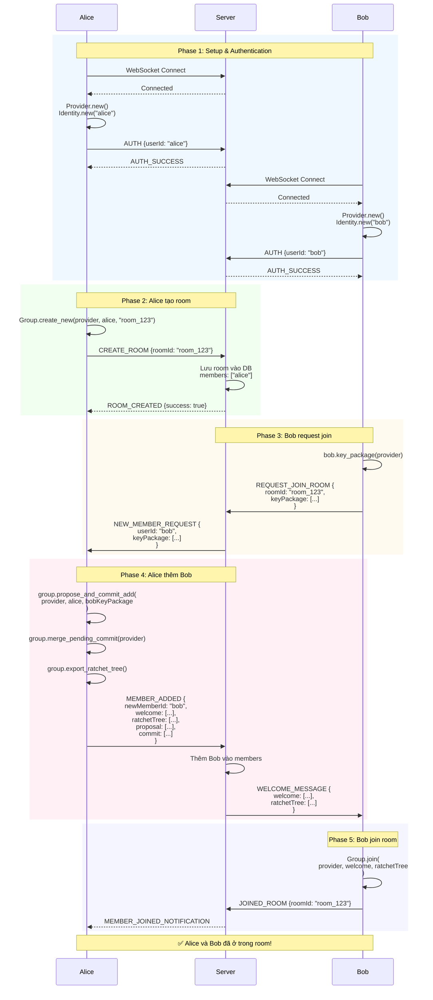
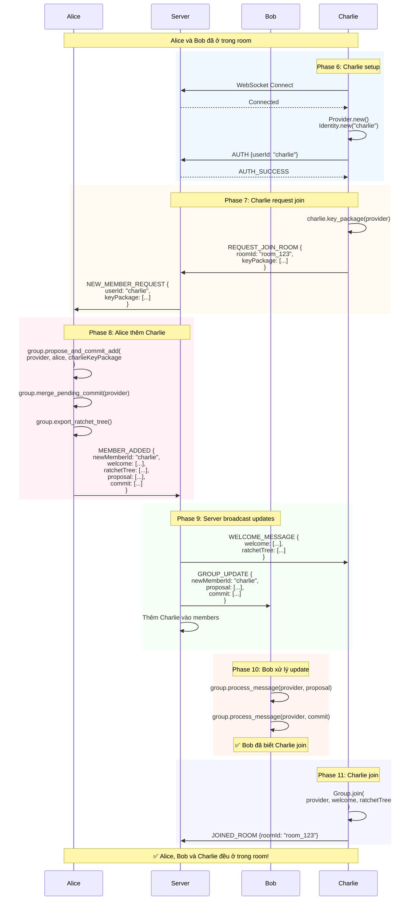
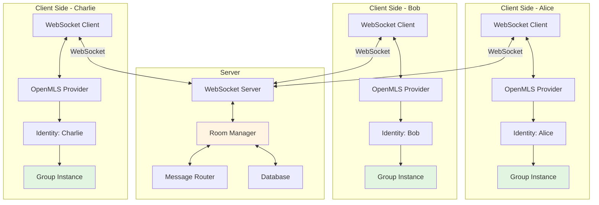
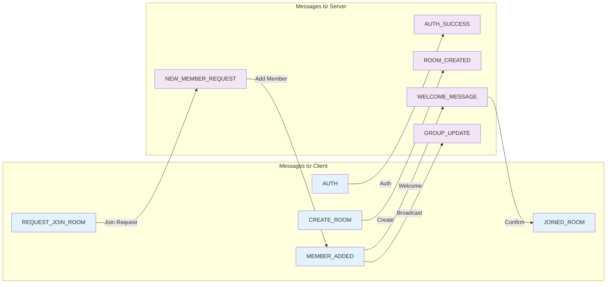
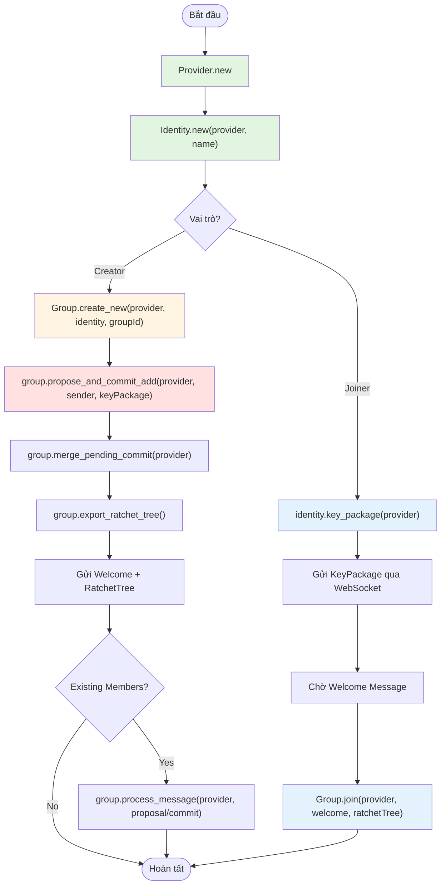

# Sơ đồ Luồng Join Room với OpenMLS + WebSocket

## Luồng Ngắn Gọn - Kịch bản 2 Người (Alice + Bob)

### Flow Trình Tự Từng Bước

1. **Alice**: Kết nối WebSocket → Server
2. **Alice**: Khởi tạo `Provider()` + `Identity("alice")`
3. **Alice**: Tạo group `Group.create_new(provider, alice, "room_123")`
4. **Alice**: Gửi `CREATE_ROOM` → Server
5. **Server**: Lưu room vào DB với members: `["alice"]`
6. **Server**: Gửi `ROOM_CREATED` → Alice
7. **Bob**: Kết nối WebSocket → Server
8. **Bob**: Khởi tạo `Provider()` + `Identity("bob")`
9. **Bob**: Tạo KeyPackage `bob.key_package(provider)`
10. **Bob**: Gửi `REQUEST_JOIN_ROOM` (kèm KeyPackage) → Server
11. **Server**: Forward `NEW_MEMBER_REQUEST` (Bob's KeyPackage) → Alice
12. **Alice**: Add Bob `group.propose_and_commit_add(provider, alice, bobKeyPackage)`
13. **Alice**: Merge `group.merge_pending_commit(provider)`
14. **Alice**: Export `group.export_ratchet_tree()`
15. **Alice**: Gửi `MEMBER_ADDED` (welcome + ratchetTree) → Server
16. **Server**: Cập nhật members: `["alice", "bob"]`
17. **Server**: Forward `WELCOME_MESSAGE` (welcome + ratchetTree) → Bob
18. **Bob**: Join group `Group.join(provider, welcome, ratchetTree)`
19. **Bob**: Gửi `JOINED_ROOM` → Server
20. **Server**: Broadcast `MEMBER_JOINED_NOTIFICATION` → Alice

✅ **Hoàn tất**: Alice và Bob đã ở trong cùng room!

---

## Tiếp tục - Người Thứ 3 Join (Charlie)

### Flow Trình Tự Từng Bước (tiếp theo)

21. **Charlie**: Kết nối WebSocket → Server
22. **Charlie**: Khởi tạo `Provider()` + `Identity("charlie")`
23. **Charlie**: Tạo KeyPackage `charlie.key_package(provider)`
24. **Charlie**: Gửi `REQUEST_JOIN_ROOM` (kèm KeyPackage) → Server
25. **Server**: Forward `NEW_MEMBER_REQUEST` (Charlie's KeyPackage) → Alice
26. **Alice**: Add Charlie `group.propose_and_commit_add(provider, alice, charlieKeyPackage)`
27. **Alice**: Merge `group.merge_pending_commit(provider)`
28. **Alice**: Export `group.export_ratchet_tree()`
29. **Alice**: Gửi `MEMBER_ADDED` (welcome + proposal + commit + ratchetTree) → Server
30. **Server**: Cập nhật members: `["alice", "bob", "charlie"]`
31. **Server**: Forward `WELCOME_MESSAGE` (welcome + ratchetTree) → Charlie
32. **Server**: Broadcast `GROUP_UPDATE` (proposal + commit) → Bob
33. **Bob**: Process proposal `group.process_message(provider, proposal)`
34. **Bob**: Process commit `group.process_message(provider, commit)`
35. **Charlie**: Join group `Group.join(provider, welcome, ratchetTree)`
36. **Charlie**: Gửi `JOINED_ROOM` → Server
37. **Server**: Broadcast `MEMBER_JOINED_NOTIFICATION` → Alice, Bob

✅ **Hoàn tất**: Alice, Bob và Charlie đều ở trong cùng room, group state đã sync!

---

## Error Handling & Recovery

### Các Trường Hợp Lỗi Phổ Biến

#### 1. **Mất kết nối WebSocket giữa chừng**

**Kịch bản**: Bob đang ở bước 18 (join group) nhưng WebSocket disconnect

**Giải pháp**:
```javascript
// Client-side reconnection logic
let reconnectAttempts = 0;
const MAX_RECONNECT_ATTEMPTS = 5;

wsCharlie.onclose = () => {
  if (reconnectAttempts < MAX_RECONNECT_ATTEMPTS) {
    setTimeout(() => {
      reconnectAttempts++;
      wsCharlie = new WebSocket('wss://your-server.com');
      // Request current state from server
      wsCharlie.onopen = () => {
        wsCharlie.send(JSON.stringify({
          type: 'SYNC_STATE',
          userId: 'charlie',
          roomId: 'room_123'
        }));
      };
    }, 1000 * Math.pow(2, reconnectAttempts)); // Exponential backoff
  }
};
```

**Server response**:
- Nếu Charlie chưa join thành công: Gửi lại `WELCOME_MESSAGE`
- Nếu Charlie đã join: Gửi `STATE_SYNCED` + danh sách members

---

#### 2. **Lỗi khi xử lý message OpenMLS**

**Kịch bản**: Bob nhận `GROUP_UPDATE` nhưng `process_message` throw error

**Giải pháp**:
```javascript
try {
  group.process_message(provider, proposal);
  group.process_message(provider, commit);
} catch (error) {
  console.error('Failed to process group update:', error);
  
  // Request full resync từ server
  ws.send(JSON.stringify({
    type: 'REQUEST_FULL_SYNC',
    roomId: 'room_123',
    userId: 'bob',
    error: error.message
  }));
}
```

**Server xử lý**:
- Export latest ratchet tree từ admin (Alice)
- Gửi toàn bộ member list + update messages chưa process

---

#### 3. **Server crash giữa chừng**

**Kịch bản**: Server crash ở bước 29 (sau khi Alice gửi `MEMBER_ADDED`)

**Giải pháp - Server persistence**:
```javascript
// Server lưu state vào DB trước khi forward messages
async function handleMemberAdded(data) {
  // 1. Lưu pending operation vào DB
  await db.savePendingOperation({
    type: 'MEMBER_ADDED',
    roomId: data.roomId,
    newMemberId: data.newMemberId,
    messages: {
      welcome: data.welcome,
      proposal: data.proposal,
      commit: data.commit
    },
    status: 'PENDING'
  });
  
  // 2. Thực hiện forward
  try {
    await forwardWelcome(data.newMemberId, data.welcome);
    await broadcastGroupUpdate(existingMembers, data.proposal, data.commit);
    
    // 3. Mark as completed
    await db.updateOperationStatus(data.roomId, 'COMPLETED');
  } catch (error) {
    // Retry logic sẽ xử lý khi server restart
  }
}

// Recovery khi server restart
async function recoverPendingOperations() {
  const pending = await db.getPendingOperations();
  for (const op of pending) {
    await retryOperation(op);
  }
}
```

---

#### 4. **Timeout khi chờ response**

**Kịch bản**: Bob gửi `REQUEST_JOIN_ROOM` nhưng không nhận được `WELCOME_MESSAGE` sau 30s

**Giải pháp - Request timeout**:
```javascript
let joinTimeout;

function requestJoinRoom(roomId, keyPackage) {
  ws.send(JSON.stringify({
    type: 'REQUEST_JOIN_ROOM',
    roomId,
    keyPackage,
    requestId: generateUUID() // Thêm unique ID
  }));
  
  joinTimeout = setTimeout(() => {
    // Retry hoặc notify user
    showError('Join room timeout. Retrying...');
    requestJoinRoom(roomId, keyPackage);
  }, 30000);
}

ws.onmessage = (event) => {
  const data = JSON.parse(event.data);
  
  if (data.type === 'WELCOME_MESSAGE') {
    clearTimeout(joinTimeout);
    // Proceed with join
  }
};
```

---

#### 5. **Alice offline khi Bob request join**

**Kịch bản**: Bob request join nhưng Alice (admin) đã offline

**Giải pháp - Admin delegation**:
```javascript
// Server tracking admin status
const roomAdmins = new Map(); // roomId -> [adminIds]

function handleJoinRequest(data) {
  const admins = roomAdmins.get(data.roomId);
  
  // Tìm admin đang online
  const onlineAdmin = admins.find(adminId => 
    isUserOnline(adminId)
  );
  
  if (onlineAdmin) {
    forwardToAdmin(onlineAdmin, data);
  } else {
    // Queue request, notify khi có admin online
    queueJoinRequest(data.roomId, data);
    
    // Hoặc reject tạm thời
    sendToUser(data.userId, {
      type: 'JOIN_PENDING',
      message: 'Admin is offline. Request queued.'
    });
  }
}
```

---

#### 6. **Duplicate messages**

**Kịch bản**: Network issue dẫn đến Bob nhận duplicate `GROUP_UPDATE`

**Giải pháp - Message deduplication**:
```javascript
const processedMessages = new Set();

ws.onmessage = (event) => {
  const data = JSON.parse(event.data);
  
  // Thêm messageId vào mọi messages
  if (processedMessages.has(data.messageId)) {
    console.log('Duplicate message, ignoring');
    return;
  }
  
  processedMessages.add(data.messageId);
  
  // Process message
  handleMessage(data);
  
  // Cleanup old messageIds (keep last 1000)
  if (processedMessages.size > 1000) {
    const oldest = Array.from(processedMessages)[0];
    processedMessages.delete(oldest);
  }
};
```

---

### Best Practices

#### Message Acknowledgment
```javascript
// Client gửi ACK sau khi xử lý thành công
ws.send(JSON.stringify({
  type: 'MESSAGE_ACK',
  messageId: data.messageId,
  status: 'SUCCESS'
}));

// Server retry nếu không nhận ACK trong 10s
const pendingMessages = new Map(); // messageId -> {data, retryCount}

function sendWithRetry(userId, message) {
  const messageId = generateUUID();
  message.messageId = messageId;
  
  pendingMessages.set(messageId, {
    data: message,
    retryCount: 0,
    sentAt: Date.now()
  });
  
  sendToUser(userId, message);
  
  // Retry logic
  setTimeout(() => checkAck(messageId), 10000);
}
```

#### Idempotent Operations
```javascript
// Đảm bảo operations có thể retry an toàn
async function addMemberIdempotent(roomId, memberId, messages) {
  // Check nếu member đã tồn tại
  const room = await db.getRoom(roomId);
  if (room.members.includes(memberId)) {
    console.log('Member already exists, skipping');
    return { status: 'ALREADY_EXISTS' };
  }
  
  // Proceed with add
  await db.addMember(roomId, memberId);
  await forwardMessages(messages);
}
```

#### State Validation
```javascript
// Validate state trước khi join
function validateBeforeJoin(welcome, ratchetTree) {
  // Check welcome message integrity
  if (!welcome || welcome.length === 0) {
    throw new Error('Invalid welcome message');
  }
  
  // Verify ratchet tree
  if (!ratchetTree || !ratchetTree.validate()) {
    throw new Error('Invalid ratchet tree');
  }
  
  // Proceed with join
  Group.join(provider, welcome, ratchetTree);
}
```

---

### Recovery Matrix

| Lỗi ở Bước | Người Gặp Lỗi | Recovery Action |
|-----------|--------------|-----------------|
| 1-6 | Alice | Reconnect, tạo lại room |
| 7-10 | Bob | Reconnect, request join lại |
| 11-15 | Alice | Retry add member, có thể cần rollback pending commit |
| 16-17 | Server | Replay từ pending operations |
| 18 | Bob | Request lại welcome message |
| 21-24 | Charlie | Reconnect, request join lại |
| 25-29 | Alice | Retry add member |
| 30-32 | Server | Replay từ pending operations |
| 33-34 | Bob | Request full resync |
| 35 | Charlie | Request lại welcome message |

---

## Kịch bản 1: Alice tạo room, Bob join (2 người)



---

## Kịch bản 2: Thêm Charlie vào room (3 người)



---

## Sơ đồ Architecture Overview



---

## Message Flow Diagram



---

## OpenMLS Functions Flow



---

## Giải thích các ký hiệu:

- 🟦 **Màu xanh dương**: Client-side actions
- 🟪 **Màu tím**: Server-side actions  
- 🟩 **Màu xanh lá**: OpenMLS operations
- 🟨 **Màu vàng**: Database/Storage operations
- 🟥 **Màu đỏ**: Important decision points

## Lưu ý quan trọng:

1. **Server không thể decrypt messages**: Server chỉ là relay, không có khóa để giải mã
2. **Ratchet Tree**: Cần thiết cho mỗi member mới join
3. **Proposal + Commit**: Phải broadcast cho tất cả existing members để sync state
4. **Welcome Message**: Chỉ gửi riêng cho member mới
